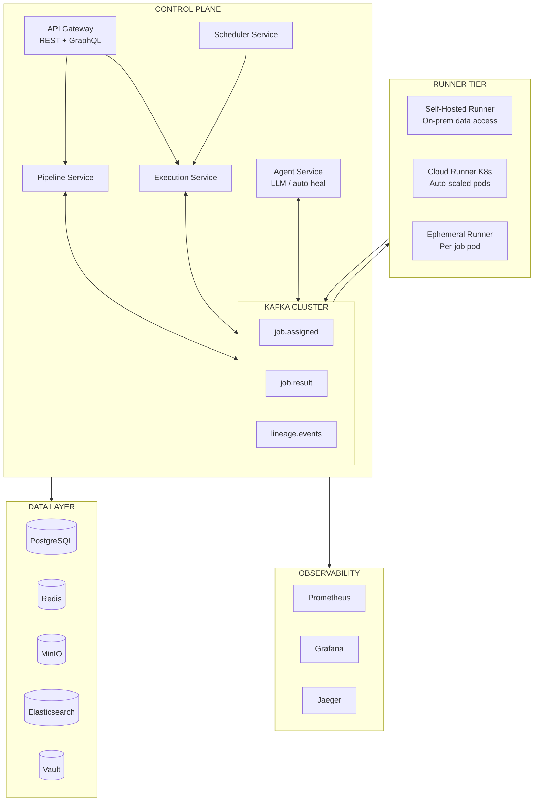
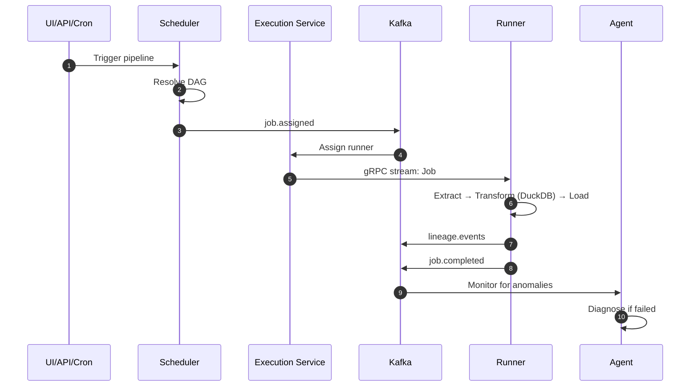

<div align="center">

# Pravah — प्रवाह

**Production-grade distributed ETL orchestration platform**

*Sanskrit: "flow" or "current"*

[](https://openjdk.org/)
[](https://spring.io/projects/spring-boot)
[](https://kafka.apache.org/)
[](https://www.postgresql.org/)
[](LICENSE)

</div>

---

## What Is Pravah?

Pravah is a **GitHub Actions / Airbyte / Prefect-level ETL platform** built from scratch — designed as an engineering deep-dive and senior-level portfolio project.

It handles the full lifecycle of data pipelines: scheduling, distributed execution across self-hosted and cloud runners, lineage tracking, observability, and an agentic layer that can detect and heal schema drift automatically.

### Core Capabilities

| Capability | Description |
|---|---|
| **Pipeline Orchestration** | DAG-based, cron-triggered, event-driven; dependency resolution and backfill |
| **Hybrid Runner Model** | Self-hosted runners (on-prem data access) + cloud runners (auto-scaled K8s pods) |
| **Kafka Event Bus** | Decoupled job lifecycle, lineage events, CDC ingestion via Debezium |
| **Multi-Tenancy** | Row-level security, namespace isolation, per-tenant resource quotas |
| **Agentic Layer** | LLM-powered auto-heal, schema drift detection, natural-language pipeline builder |
| **Full Observability** | Prometheus → Grafana dashboards, distributed tracing (Jaeger), ELK log aggregation |
| **Data Lineage** | Column-level lineage via OpenLineage spec, stored in Elasticsearch |

---

## Architecture Overview



**Data flow for a single pipeline run:**



See [`docs/architecture/high-level-architecture.md`](docs/architecture/high-level-architecture.md) for the complete design document.

---

## Tech Stack

| Layer | Technology |
|-------|------------|
| **Services** | Java 21 · Spring Boot 3 · Spring Cloud |
| **Inter-service** | gRPC (sync/streaming) + Kafka (async events) |
| **Runner protocol** | gRPC bidirectional stream · mTLS per-runner certs |
| **External API** | REST (mutations, SDK) + GraphQL (UI read queries) |
| **Database** | PostgreSQL 16 + Flyway · Patroni HA (auto-failover) |
| **Cache / State** | Redis Sentinel — locks, pub/sub, rate limiting |
| **Object Store** | MinIO (S3-compatible) — artifacts, logs, snapshots |
| **Search / Lineage** | Elasticsearch — log search, data catalog, lineage graph |
| **Secrets** | HashiCorp Vault — dynamic credentials, mTLS PKI |
| **Processing** | DuckDB (embedded, per runner) — in-process SQL transforms |
| **Observability** | Prometheus + Grafana + OpenTelemetry + Jaeger + ELK |
| **Auth** | JWT RS256 + OAuth 2.0 + SSO (OIDC/SAML 2.0) + mTLS |
| **Data lineage** | OpenLineage spec — column-level, stored in Elasticsearch |
| **Infra / GitOps** | Kubernetes + Helm + Argo CD + KEDA |
| **UI** | Next.js 14 · React Flow (DAG canvas) · TailwindCSS |
| **Agent** | Spring AI · Claude / GPT-4 · ReAct · pgvector |

---

## Repository Layout

```
Pravah/
├── README.md
│
├── docs/
│   ├── architecture/
│   │   └── high-level-architecture.md    # Full service map, data flows, infra
│   ├── adr/                              # Architecture Decision Records (ADR-001–033)
│   ├── design/                           # API contracts, event schemas
│   ├── product/                          # Product vision, epics, user stories
│   ├── lld/                              # Low-level design (patterns, ERDs, state machines)
│   └── theory/                           # 9-phase engineering curriculum (75 chapters)
│
├── playground/                           # Hands-on learning exercises (12 modules)
│   ├── 01-kafka/                         # Kafka producer, consumer, exactly-once
│   ├── 02-grpc/                          # Bidirectional streaming, mTLS
│   ├── 03-postgresql/                    # Partitioning, RLS, PgBouncer
│   ├── 04-redis/                         # Distributed locks, rate limiting
│   ├── 05-vault/                         # Dynamic credentials, PKI
│   ├── 06-outbox-pattern/                # Transactional outbox
│   ├── 07-saga/                          # Choreography-based saga
│   ├── 08-duckdb/                        # In-process analytics
│   ├── 09-spring-ai/                     # ReAct pattern, LLM tools
│   ├── 10-kubernetes/                    # Kind, KEDA auto-scaling
│   ├── 11-opentelemetry/                 # Distributed tracing
│   └── 12-graphql/                       # DataLoader, pagination
│
└── implementation/                       # Source code (coming next)
    ├── services/                         # Spring Boot microservices
    ├── runner/                           # Standalone runner binary
    ├── proto/                            # Protobuf contracts
    └── infra/                            # Docker Compose, Helm charts
```

---

## Documentation

### Theory Curriculum (75 chapters)

The [`docs/theory/`](docs/theory/) directory is a **self-contained engineering course** covering every concept needed to build a distributed system at this scale.

| Phase | Topic | Chapters |
|-------|-------|----------|
| **1** | Distributed Systems Fundamentals | 12 ✅ |
| **2** | Messaging & Kafka Internals | 12 ✅ |
| **3** | Database Design & Scaling | 13 ✅ |
| **4** | Observability & Reliability | 7 ✅ |
| **5** | Security, Auth & Multi-Tenancy | 7 ✅ |
| **6** | Kubernetes & Production Infra | 6 ✅ |
| **7** | AI/Agent Architecture | 7 ✅ |
| **8** | ETL & Data Engineering | 7 ✅ |
| **9** | System Design Synthesis | 4 ✅ |

### Architecture & Design

| Document | Description |
|----------|-------------|
| [High-Level Architecture](docs/architecture/high-level-architecture.md) | Complete service map, data flows, infrastructure |
| [ADR Index](docs/adr/README.md) | 33 Architecture Decision Records |
| [Design Patterns](docs/lld/01-design-patterns.md) | 28 patterns with code examples |
| [Database ERD](docs/lld/02-database-erd.md) | Complete schemas for all 8 services |
| [State Machines](docs/lld/03-state-machines.md) | Pipeline, Execution, Job, Runner lifecycles |
| [Sequence Diagrams](docs/lld/04-sequence-diagrams.md) | 8 key system flows |
| [Class Diagrams](docs/lld/05-class-diagrams.md) | Domain models per service |
| [Scalability Analysis](docs/lld/06-scalability-failure-analysis.md) | Bottlenecks, failures, DR planning |

### Product Documentation

| Document | Description |
|----------|-------------|
| [Product Vision](docs/product/PRODUCT-VISION.md) | Mission, value props, target users |
| [Epics Overview](docs/product/EPICS-OVERVIEW.md) | 12 epics, 180 user stories |
| [Release Plan](docs/product/releases/RELEASE-PLAN.md) | Alpha → Beta → GA roadmap |

---

## Project Status

```
Theory (75 chapters)                        ████████████████████ 100%
Architecture Decision Records (33 ADRs)     ████████████████████ 100%
Product Documentation (12 epics)            ████████████████████ 100%
Low-Level Design (6 documents)              ████████████████████ 100%
Playground Exercises (12 modules)           ████████████████████ 100%
Implementation                              ░░░░░░░░░░░░░░░░░░░░ 0%   ← Next
```

### Completed

- ✅ 75 theory chapters across 9 phases
- ✅ 33 Architecture Decision Records
- ✅ High-Level Architecture with all 11 services
- ✅ Product documentation: vision, 12 epics, 180 user stories
- ✅ Low-Level Design: patterns, ERDs, state machines, sequences
- ✅ 12 playground modules for hands-on learning

### Next Steps

- 📋 Gradle multi-module project skeleton
- 📋 Protobuf contracts for all gRPC services
- 📋 Database schemas + Flyway migrations
- 📋 Docker Compose local dev environment
- 📋 Kubernetes + Helm charts

---

## Playground Modules

Each playground is a standalone Spring Boot project demonstrating a core concept:

| Module | Concepts | Technologies |
|--------|----------|--------------|
| **01-kafka** | Producer, Consumer Groups, Exactly-Once, DLT | Kafka, Spring Kafka, Testcontainers |
| **02-grpc** | Bidirectional Streaming, Reflection | gRPC, Protobuf, Netty |
| **03-postgresql** | Partitioning, RLS, Connection Pooling | PostgreSQL 16, PgBouncer, Flyway |
| **04-redis** | Distributed Locks, Rate Limiting | Redis 7, Lua Scripts, Spring Data Redis |
| **05-vault** | Dynamic Credentials, PKI | HashiCorp Vault, Spring Vault |
| **06-outbox** | Transactional Outbox Pattern | PostgreSQL, Kafka, JPA |
| **07-saga** | Choreography, Compensation | Kafka, Event-Driven, Idempotency |
| **08-duckdb** | In-Process Analytics, Parquet | DuckDB, JDBC |
| **09-spring-ai** | ReAct Pattern, Tool Calling | Spring AI, Gemini |
| **10-kubernetes** | Auto-scaling, KEDA | Kind, KEDA, Kafka Trigger |
| **11-opentelemetry** | Distributed Tracing | OTel, Jaeger, OTLP |
| **12-graphql** | DataLoader, Pagination | Spring GraphQL, N+1 Prevention |

---

## Getting Started

```bash
# Clone the repo
git clone https://github.com/AbhishekKr-Jha/Pravah.git
cd Pravah

# Start with the theory curriculum
open docs/theory/README.md

# Or explore the architecture
open docs/architecture/high-level-architecture.md

# Run a playground module
cd playground/01-kafka
./gradlew test
```

---

## Key Design Decisions

| Decision | Choice | Rationale |
|----------|--------|-----------|
| Event backbone | Kafka over RabbitMQ | Log-based replay, partitioning, exactly-once semantics |
| Inter-service sync | gRPC over REST | Streaming, type safety, performance |
| Multi-tenancy | RLS over schema-per-tenant | Simpler ops, connection pooling friendly |
| Saga pattern | Choreography over orchestration | Loose coupling, no coordinator bottleneck |
| Pipeline state | Event Sourcing | Full audit trail, time-travel debugging |
| DB consistency | Transactional Outbox | Dual-write problem solved without 2PC |

See the [ADR Index](docs/adr/README.md) for all 33 decisions with context and trade-offs.

---

## System Design Interview Angles

This project demonstrates production-ready implementations of:

- **Distributed Systems**: CAP theorem trade-offs, consensus, leader election
- **Messaging**: Exactly-once semantics, consumer groups, dead letter queues
- **Database**: Partitioning, RLS, connection pooling, event sourcing
- **Resilience**: Circuit breakers, bulkheads, retry with backoff
- **Observability**: Metrics, tracing, logging, alerting
- **Security**: mTLS, JWT, RBAC, secrets management
- **Scalability**: Horizontal scaling, KEDA, bottleneck analysis

---

<div align="center">

Built as a serious engineering study — every design decision is intentional, documented, and interview-ready.

**[Theory](docs/theory/README.md) · [Architecture](docs/architecture/high-level-architecture.md) · [ADRs](docs/adr/README.md) · [Product](docs/product/README.md) · [LLD](docs/lld/README.md)**

</div>
