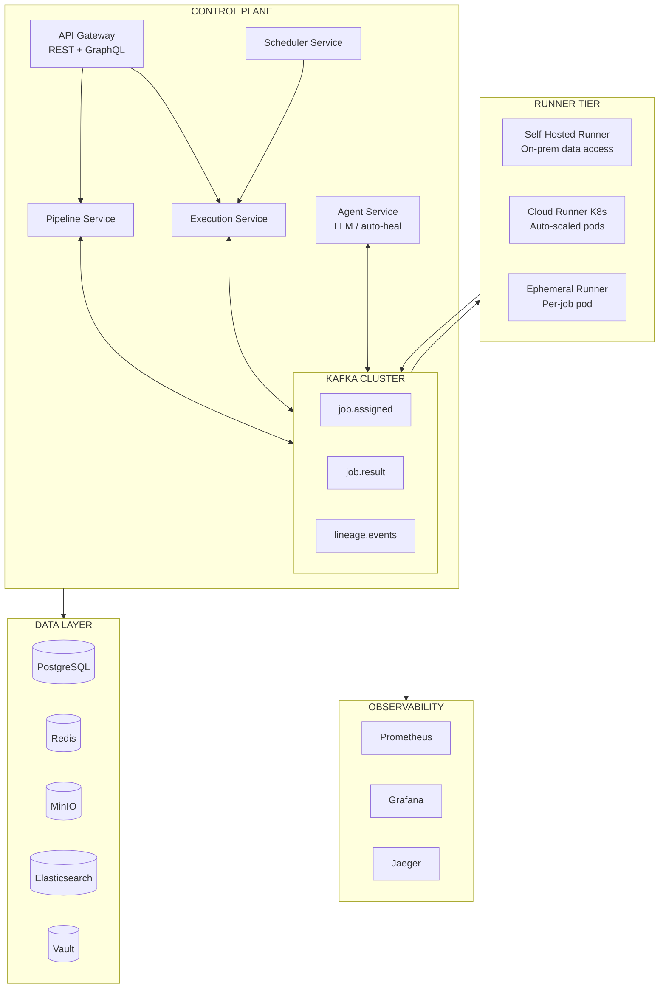
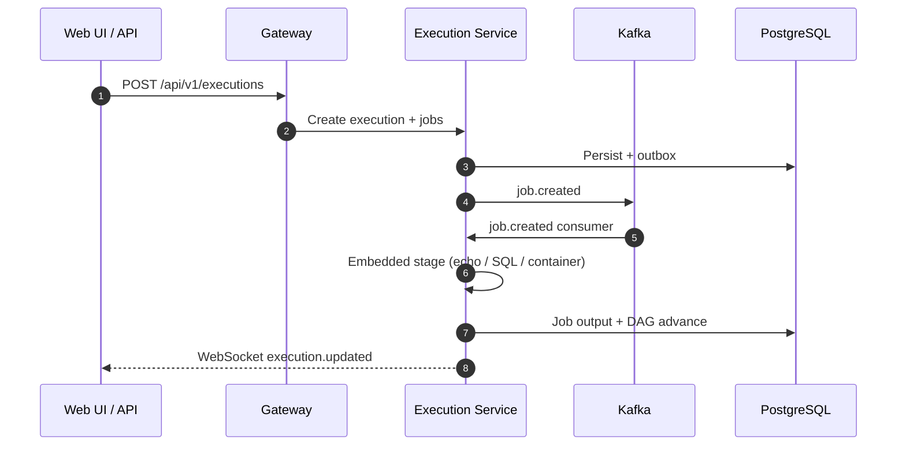

<div align="center">

# Pravah — प्रवाह

**Production-grade distributed ETL orchestration platform**

*Sanskrit: "flow" or "current"*

[](https://openjdk.org/)
[](https://spring.io/projects/spring-boot)
[](https://kafka.apache.org/)
[](https://www.postgresql.org/)
[](LICENSE)

</div>

---

## What Is Pravah?

Pravah is a **GitHub Actions / Airbyte / Prefect-level ETL platform** built from scratch — designed as an engineering deep-dive and senior-level portfolio project.

It handles the full lifecycle of data pipelines: scheduling, distributed execution across self-hosted and cloud runners, lineage tracking, observability, and an agentic layer that can detect and heal schema drift automatically.

> **Current repo:** The **alpha control plane** is implemented (pipelines, runs, embedded stages, schedules, web UI). Runner fleets, lineage, catalog, and AI features are **designed but not built** here yet. See **[Implementation Status](docs/IMPLEMENTATION_STATUS.md)** for an accurate checklist.

### Core Capabilities (target platform)

| Capability | Description |
|---|---|
| **Pipeline Orchestration** | DAG-based, cron-triggered, event-driven; dependency resolution and backfill |
| **Hybrid Runner Model** | Self-hosted runners (on-prem data access) + cloud runners (auto-scaled K8s pods) |
| **Kafka Event Bus** | Decoupled job lifecycle, lineage events, CDC ingestion via Debezium |
| **Multi-Tenancy** | Row-level security, namespace isolation, per-tenant resource quotas |
| **Agentic Layer** | LLM-powered auto-heal, schema drift detection, natural-language pipeline builder |
| **Full Observability** | Prometheus → Grafana dashboards, distributed tracing (Jaeger), ELK log aggregation |
| **Data Lineage** | Column-level lineage via OpenLineage spec, stored in Elasticsearch |

### Alpha (implemented today)

| Capability | Where |
|---|---|
| YAML pipelines + publish validation | `pipeline-service` |
| Manual runs, cancel, retry, timeouts | `execution-service` |
| Stage types: echo, SQL, container (Docker) | Embedded executors in `execution-service` |
| Stage output passing `${stages.*.output.*}` | `libs/common` + `execution-service` |
| Cron schedules | `scheduler-service` |
| Web UI (workflows, runs, logs, schedules) | `web/` |
| Real-time run status | WebSocket via gateway → `execution-service` |

---

## Architecture Overview

The diagram below is the **target** architecture. Alpha runs stages inside `execution-service` (no external runner gRPC yet).



**Alpha execution path (today):**



See [`docs/architecture/high-level-architecture.md`](docs/architecture/high-level-architecture.md) for the complete **target** design.

---

## Tech Stack

| Layer | Technology |
|-------|------------|
| **Services** | Java 21 · Spring Boot 3 · Spring Cloud |
| **Inter-service** | HTTP/REST (alpha); gRPC + Kafka (target) |
| **Runner protocol** | gRPC bidirectional stream · mTLS per-runner certs (target) |
| **External API** | REST (mutations, SDK) + GraphQL (UI read queries, planned) |
| **Database** | PostgreSQL 16 + Flyway · Patroni HA (target) |
| **Cache / State** | Redis — locks, pub/sub, WebSocket fan-out |
| **Object Store** | MinIO (S3-compatible) — artifacts (target) |
| **Search / Lineage** | Elasticsearch — log search, lineage (target) |
| **Secrets** | Tenant secrets DB + `env:` refs; Vault (target) |
| **Processing** | DuckDB (embedded, per runner, target) |
| **Observability** | Prometheus + Grafana + OpenTelemetry + Jaeger + ELK (target) |
| **Auth** | JWT RS256 (email/password login); OAuth / SSO (target) |
| **UI** | Vite 6 · React 19 · Tailwind CSS v4 · React Router 7 (`web/`) |
| **Agent** | Spring AI · Claude / GPT-4 · ReAct · pgvector (target) |

---

## Repository Layout

```
Pravah/
├── README.md
├── docs/
│   ├── README.md                  # Documentation index
│   ├── IMPLEMENTATION_STATUS.md   # What is built vs planned (keep updated)
│   ├── architecture/              # HLA, API contracts
│   ├── adr/                       # ADR-001–033
│   ├── lld/                       # Patterns, ERD, state machines, value resolution
│   ├── product/                   # Epics and user stories
│   └── theory/                    # 9-phase curriculum (75 chapters)
├── playground/                    # 12 standalone learning modules
├── web/                           # React SPA (alpha UI)
├── backend/
│   ├── libs/                      # common, proto, spring-support, test-support
│   ├── services/                  # 11 Spring Boot apps (5 implemented, 6 stubs)
│   ├── runner/                    # Standalone runner CLI (skeleton)
│   ├── docker-compose.yml         # Local Postgres, Kafka, Redis, …
│   └── scripts/local/             # local-up, local-services, seed, …
└── scripts/pre-commit.sh          # CI-parity checks before commit
```

---

## Getting Started

### Local full stack (recommended)

Requires **JDK 21**, **Docker**, **Node.js 22**, and `npm`.

```bash
git clone https://github.com/Abhishekkumar2021/Pravah.git
cd Pravah

# One-time: env files for backend + web
make local-setup

# Infrastructure (Postgres, Kafka, Redis, …)
make local-up

# Java services: tenant → pipeline → execution → scheduler → gateway
make local-services

# Demo tenant, pipelines, sample runs (once per DB)
make local-seed

# Web UI (another terminal)
make local-web
# Open http://localhost:5173 — sign in dev@localhost.pravah / PravahDev1! (after seed)
```

Gateway: `http://localhost:8080` · API via Vite proxy: `http://localhost:5173`

### Build and test

```bash
# Backend
cd backend && ./gradlew test integrationTest

# Web
cd web && npm ci && npm run lint && npm run test

# Full pre-commit (backend + web + e2e)
./scripts/pre-commit.sh
```

### Learning path

```bash
open docs/theory/README.md          # Curriculum
open docs/IMPLEMENTATION_STATUS.md  # What exists in code today
cd playground/01-kafka && ./gradlew test
```

---

## Documentation

### Implementation & product

| Document | Description |
|----------|-------------|
| **[Implementation Status](docs/IMPLEMENTATION_STATUS.md)** | **What is built in this repo (update with each feature)** |
| [Product Vision](docs/product/PRODUCT-VISION.md) | Mission, value props, target users |
| [Epics Overview](docs/product/EPICS-OVERVIEW.md) | 12 epics, 180 user stories |
| [Release Plan](docs/product/releases/RELEASE-PLAN.md) | Alpha → Beta → GA roadmap |

### Theory curriculum (75 chapters)

| Phase | Topic |
|-------|-------|
| **1** | Distributed Systems Fundamentals |
| **2** | Messaging & Kafka Internals |
| **3** | Database Design & Scaling |
| **4** | Observability & Reliability |
| **5** | Security, Auth & Multi-Tenancy |
| **6** | Kubernetes & Production Infra |
| **7** | AI/Agent Architecture |
| **8** | ETL & Data Engineering |
| **9** | System Design Synthesis |

See [`docs/theory/README.md`](docs/theory/README.md).

### Architecture & design

| Document | Description |
|----------|-------------|
| [High-Level Architecture](docs/architecture/high-level-architecture.md) | Target service map (see implementation status for gaps) |
| [ADR Index](docs/adr/README.md) | 33 Architecture Decision Records |
| [Design Patterns](docs/lld/01-design-patterns.md) | 28 patterns with code examples |
| [Database ERD](docs/lld/02-database-erd.md) | Schemas for all services |
| [State Machines](docs/lld/03-state-machines.md) | Pipeline, Execution, Job lifecycles |
| [Sequence Diagrams](docs/lld/04-sequence-diagrams.md) | Key system flows |
| [Value Resolution](docs/lld/07-value-resolution.md) | Variables, secrets, stage outputs |
| [Execution WebSocket](docs/lld/07-execution-realtime-websocket.md) | Real-time run updates |
| [LLD Index](docs/lld/README.md) | All low-level design documents |

---

## Project Status

```
Documentation (theory, ADRs, product, LLD)     ████████████████████ 100%
Engineering foundation (Gradle, CI, compose)   █████████████████░░░  85%
Core control plane (5 services + gateway)      ████████████░░░░░░░░  55%
Web alpha shell (REST + WebSocket)             ██████████░░░░░░░░░░  45%
Remaining microservices (6 stubs)              █░░░░░░░░░░░░░░░░░░░   5%
Runner fleet + gRPC control plane              ██░░░░░░░░░░░░░░░░░░  10%
Full platform vs vision (~180 stories)         ███████░░░░░░░░░░░░░  30%
```

Details: **[docs/IMPLEMENTATION_STATUS.md](docs/IMPLEMENTATION_STATUS.md)**

### Done in repo

- Gradle multi-module backend, shared libs, Flyway migrations, Testcontainers ITs
- Pipeline + execution + scheduler + tenant + gateway
- Kafka job/execution consumers, transactional outbox
- Embedded echo / SQL / container stages; stage output resolution (US-02.10)
- Web UI: workflows, runs, logs, cancel, schedules, realtime
- `backend/docker-compose.yml`, `make local-*`, `./scripts/pre-commit.sh`

### In progress / next (alpha → beta)

- Retry from failed stage (US-02.05), checkpointing (US-02.12)
- Tenant integration tests, hardened publish validation (US-01.12)
- GraphQL read model (ADR-033), external runner dispatch
- Helm/K8s app charts, production observability stack

---

## Playground Modules

Each playground is a standalone Spring Boot project demonstrating a core concept:

| Module | Concepts | Technologies |
|--------|----------|--------------|
| **01-kafka** | Producer, Consumer Groups, Exactly-Once, DLT | Kafka, Spring Kafka, Testcontainers |
| **02-grpc** | Bidirectional Streaming, Reflection | gRPC, Protobuf, Netty |
| **03-postgresql** | Partitioning, RLS, Connection Pooling | PostgreSQL 16, PgBouncer, Flyway |
| **04-redis** | Distributed Locks, Rate Limiting | Redis 7, Lua Scripts, Spring Data Redis |
| **05-vault** | Dynamic Credentials, PKI | HashiCorp Vault, Spring Vault |
| **06-outbox** | Transactional Outbox Pattern | PostgreSQL, Kafka, JPA |
| **07-saga** | Choreography, Compensation | Kafka, Event-Driven, Idempotency |
| **08-duckdb** | In-Process Analytics, Parquet | DuckDB, JDBC |
| **09-spring-ai** | ReAct Pattern, Tool Calling | Spring AI, Gemini |
| **10-kubernetes** | Auto-scaling, KEDA | Kind, KEDA, Kafka Trigger |
| **11-opentelemetry** | Distributed Tracing | OTel, Jaeger, OTLP |
| **12-graphql** | DataLoader, Pagination | Spring GraphQL, N+1 Prevention |

---

## Key Design Decisions

| Decision | Choice | Rationale |
|----------|--------|-----------|
| Event backbone | Kafka over RabbitMQ | Log-based replay, partitioning, exactly-once semantics |
| Inter-service sync | gRPC over REST (target) | Streaming, type safety, performance |
| Multi-tenancy | RLS over schema-per-tenant | Simpler ops, connection pooling friendly |
| Saga pattern | Choreography over orchestration | Loose coupling, no coordinator bottleneck |
| Pipeline state | Event Sourcing | Full audit trail, time-travel debugging |
| DB consistency | Transactional Outbox | Dual-write problem solved without 2PC |

See the [ADR Index](docs/adr/README.md) for all 33 decisions with context and trade-offs.

---

## Contributing

See [CONTRIBUTING.md](CONTRIBUTING.md) for branch strategy, PR workflow, and `./scripts/pre-commit.sh` before every commit.

---

<div align="center">

Built as a serious engineering study — every design decision is intentional, documented, and interview-ready.

**[Implementation status](docs/IMPLEMENTATION_STATUS.md) · [Theory](docs/theory/README.md) · [Architecture](docs/architecture/high-level-architecture.md) · [ADRs](docs/adr/README.md) · [Product](docs/product/README.md) · [LLD](docs/lld/README.md)**

</div>
