# Design Patterns Catalog

This document catalogs all design patterns used in Pravah, explaining **what**, **where**, **why**, and **how** for each pattern. Use this as your interview reference.

---

## Pattern Summary

| Pattern | Category | Where Used | Interview Priority |
|---------|----------|------------|-------------------|
| [Event Sourcing](#1-event-sourcing) | Data | Pipeline Service | ⭐⭐⭐ High |
| [Transactional Outbox](#2-transactional-outbox) | Messaging | All services publishing events | ⭐⭐⭐ High |
| [Saga (Choreography)](#3-saga-choreography) | Distributed Transactions | Execution flow | ⭐⭐⭐ High |
| [CQRS](#4-cqrs-command-query-responsibility-segregation) | Data | Pipeline, Execution Services | ⭐⭐⭐ High |
| [API Gateway](#5-api-gateway) | Integration | Gateway Service | ⭐⭐ Medium |
| [Backend for Frontend (BFF)](#6-backend-for-frontend-bff) | Integration | GraphQL layer | ⭐⭐ Medium |
| [Circuit Breaker](#7-circuit-breaker) | Resilience | Inter-service calls | ⭐⭐ Medium |
| [Retry with Exponential Backoff](#8-retry-with-exponential-backoff) | Resilience | Kafka consumers, HTTP clients | ⭐⭐ Medium |
| [Bulkhead](#9-bulkhead) | Resilience | Thread pools, connection pools | ⭐⭐ Medium |
| [Database per Service](#10-database-per-service) | Data | All microservices | ⭐⭐ Medium |
| [Strangler Fig](#11-strangler-fig) | Migration | Airflow migration path | ⭐ Low |
| [Sidecar](#12-sidecar) | Deployment | Vault Agent, Fluent Bit | ⭐⭐ Medium |
| [Ambassador](#13-ambassador) | Deployment | PgBouncer | ⭐ Low |
| [Leader Election](#14-leader-election) | Coordination | Scheduler Service | ⭐⭐ Medium |
| [Competing Consumers](#15-competing-consumers) | Messaging | Kafka consumer groups | ⭐⭐ Medium |
| [Idempotent Consumer](#16-idempotent-consumer) | Messaging | All Kafka consumers | ⭐⭐⭐ High |
| [Dead Letter Queue](#17-dead-letter-queue) | Messaging | Failed message handling | ⭐⭐ Medium |
| [Claim Check](#18-claim-check) | Messaging | Large payloads | ⭐ Low |
| [Repository](#19-repository) | Data Access | All services | ⭐⭐ Medium |
| [Unit of Work](#20-unit-of-work) | Data Access | Transaction management | ⭐⭐ Medium |
| [Domain Events](#21-domain-events) | DDD | Pipeline lifecycle events | ⭐⭐ Medium |
| [Aggregate Root](#22-aggregate-root) | DDD | Pipeline, Execution entities | ⭐⭐ Medium |
| [Value Object](#23-value-object) | DDD | CronExpression, PipelineVersion | ⭐ Low |
| [Factory](#24-factory) | Creational | Stage executors | ⭐ Low |
| [Strategy](#25-strategy) | Behavioral | Stage execution strategies | ⭐⭐ Medium |
| [Observer](#26-observer) | Behavioral | Event listeners | ⭐ Low |
| [State Machine](#27-state-machine) | Behavioral | Execution state transitions | ⭐⭐⭐ High |
| [Template Method](#28-template-method) | Behavioral | Base stage executor | ⭐ Low |

---

## Distributed Systems Patterns

### 1. Event Sourcing

**What:** Store all changes to application state as a sequence of events. Instead of storing current state, store the events that led to current state.

**Where:** Pipeline Service — all pipeline changes stored as events

**Why:**
- Complete audit trail (compliance requirement)
- Time-travel debugging ("what was this pipeline last Tuesday?")
- Agent Service needs full history to reason about failures
- Enables rebuilding projections without data loss

**How:**

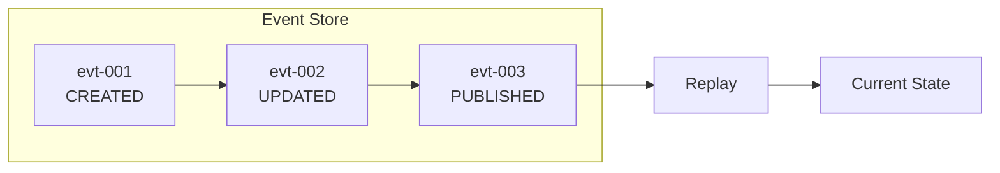

| event_id | pipeline_id | event_type | payload |
|----------|-------------|------------|---------|
| evt-001 | pipe-123 | CREATED | {name: "ETL"} |
| evt-002 | pipe-123 | UPDATED | {changes: [...]} |
| evt-003 | pipe-123 | PUBLISHED | {version: 2} |

**Trade-offs:**
- ✅ Complete history, audit, replay
- ❌ More storage, eventual consistency, complex queries for current state

**Interview Question:** "How do you handle schema evolution in event sourcing?"
**Answer:** Events are immutable. Use upcasters to transform old event formats to new when replaying. Version field in each event enables this.

**Related ADR:** [ADR-017](../adr/ADR-017-event-sourcing-pipeline-service.md)

---

### 2. Transactional Outbox

**What:** Ensure exactly-once delivery of events by writing to an outbox table in the same transaction as the business data, then a separate process publishes to Kafka.

**Where:** All services that publish Kafka events

**Why:**
- Dual-write problem: writing to DB and Kafka separately can fail partially
- Without outbox: DB commits, Kafka publish fails → inconsistent state
- With outbox: both writes are in same transaction → atomic

**How:**

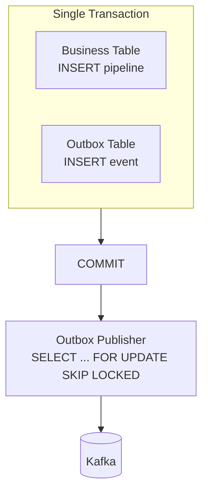

**Trade-offs:**
- ✅ Guarantees consistency between DB and Kafka
- ❌ Adds latency (polling interval), requires cleanup job

**Interview Question:** "What's the dual-write problem and how do you solve it?"
**Answer:** When writing to two systems (DB + message queue), partial failure leaves inconsistent state. Outbox pattern makes it atomic by writing both to DB in same transaction, then reliably publishing from outbox.

**Related ADR:** [ADR-004](../adr/ADR-004-transactional-outbox.md)

---

### 3. Saga (Choreography)

**What:** Manage distributed transactions across services through a sequence of local transactions coordinated by events. Each service listens for events and performs its action, publishing the next event.

**Where:** Pipeline execution flow — Execution Service → Runner Service → back to Execution Service

**Why:**
- No distributed transactions (2PC) across services
- Services remain loosely coupled
- Natural fit for event-driven architecture
- Compensation (rollback) is explicit

**How:**

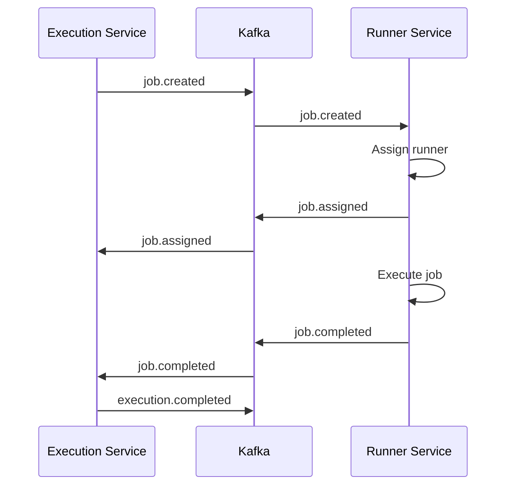

**Compensation Example:**

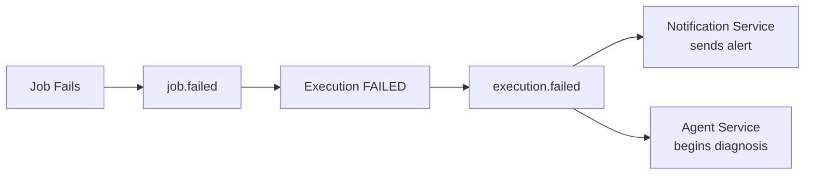

**Trade-offs:**
- ✅ Loose coupling, no coordinator bottleneck
- ❌ Harder to track overall flow, eventual consistency

**Interview Question:** "Why choreography over orchestration?"
**Answer:** Choreography fits our event-driven architecture naturally. No central coordinator bottleneck. Services are independently deployable. Trade-off: harder to visualize the overall flow, but we address this with distributed tracing (OpenTelemetry).

**Related ADR:** [ADR-011](../adr/ADR-011-saga-choreography.md)

---

### 4. CQRS (Command Query Responsibility Segregation)

**What:** Separate the read model (queries) from the write model (commands). Use different data structures optimized for each.

**Where:** 
- Pipeline Service: Event store (write) + Current state projection (read)
- Gateway Service: GraphQL aggregates data from multiple sources for reads

**Why:**
- Reads and writes have different optimization needs
- Read-heavy workloads can scale independently
- Event-sourced write model + denormalized read model

**How:**

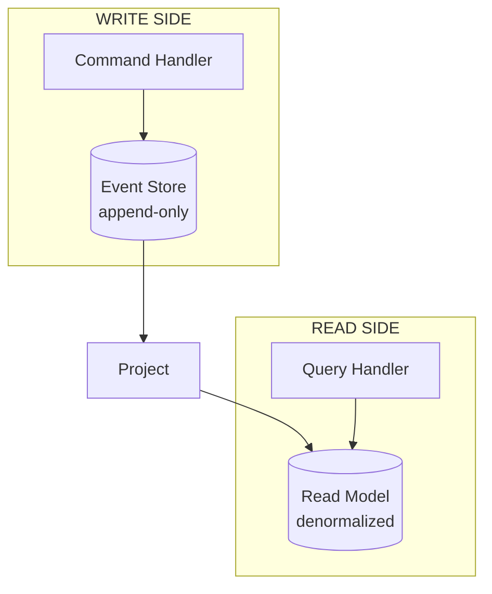

**Trade-offs:**
- ✅ Optimized reads, optimized writes, scalable independently
- ❌ Eventual consistency, more complex, data duplication

**Interview Question:** "When would you NOT use CQRS?"
**Answer:** Simple CRUD applications with low scale. The complexity overhead isn't justified. Also avoid when strong consistency is required between read and write — CQRS has eventual consistency between models.

---

### 5. API Gateway

**What:** Single entry point for all client requests. Routes to appropriate backend services, handles cross-cutting concerns.

**Where:** Gateway Service

**Why:**
- Single entry point simplifies client integration
- Cross-cutting concerns: authentication, rate limiting, logging
- Protocol translation (REST, GraphQL, gRPC)
- Aggregates responses from multiple services

**How:**

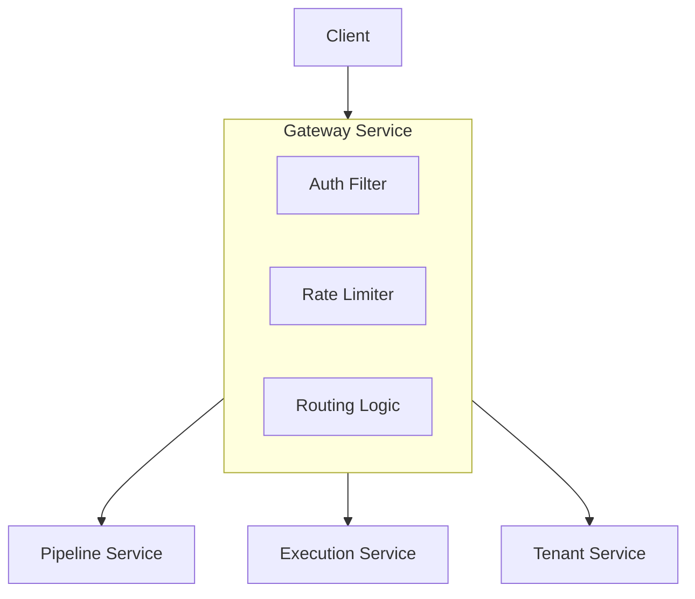

**Related ADR:** [ADR-033](../adr/ADR-033-graphql-api.md)

---

### 6. Backend for Frontend (BFF)

**What:** Create separate backend services tailored to specific frontend needs.

**Where:** GraphQL layer in Gateway Service

**Why:**
- Web UI needs aggregated data (pipeline + latest execution + lineage)
- REST would require multiple round trips
- GraphQL acts as BFF: one query, one response, exactly the fields needed

**Interview Question:** "Why GraphQL instead of REST?"
**Answer:** The UI dashboard needs pipeline definition + latest execution + lineage in one render. Without GraphQL, that's 4 REST calls. With GraphQL, it's one query. GraphQL is our BFF for the web UI.

---

### 7. Circuit Breaker

**What:** Prevent cascading failures by stopping calls to a failing service. After failures exceed threshold, "open" the circuit and fail fast.

**Where:** Inter-service HTTP calls, external API calls

**Why:**
- Prevents thread exhaustion waiting for timeouts
- Gives failing service time to recover
- Graceful degradation instead of total failure

**How:**

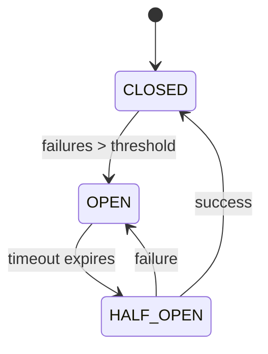

**States:**
- **CLOSED:** Normal operation, calls pass through
- **OPEN:** Fail immediately, don't call downstream
- **HALF-OPEN:** Allow one test call to check recovery

**Implementation:** Resilience4j library

**Trade-offs:**
- ✅ Prevents cascading failures, fast failure
- ❌ May reject valid requests during recovery window

---

### 8. Retry with Exponential Backoff

**What:** Retry failed operations with increasing delays between attempts.

**Where:** Kafka consumers, HTTP clients, database connections

**Why:**
- Transient failures (network blips) often succeed on retry
- Exponential backoff prevents thundering herd
- Jitter prevents synchronized retries across instances

**How:**

```java
// Retry delays: 1s, 2s, 4s, 8s, 16s (capped)
// With jitter: 0.8s-1.2s, 1.6s-2.4s, ...

@Retryable(
    value = {TransientException.class},
    maxAttempts = 5,
    backoff = @Backoff(delay = 1000, multiplier = 2, maxDelay = 16000)
)
public void processMessage(Message msg) { ... }
```

**Interview Question:** "Why add jitter to backoff?"
**Answer:** Without jitter, if 100 consumers fail at the same time, they all retry at exactly 1s, 2s, 4s... creating synchronized load spikes. Jitter spreads retries randomly across the interval.

---

### 9. Bulkhead

**What:** Isolate components so failure in one doesn't affect others. Like bulkheads in a ship.

**Where:** Thread pools per service, connection pools per database

**Why:**
- Slow downstream service shouldn't exhaust all threads
- Database issues shouldn't affect unrelated features
- Resource isolation prevents total system failure

**How:**

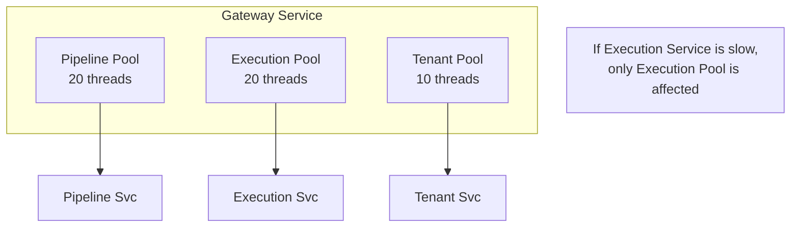

---

### 10. Database per Service

**What:** Each microservice owns its database. No direct database sharing between services.

**Where:** All services

**Why:**
- Services are independently deployable
- Schema changes don't require coordinated deployments
- Technology freedom (some services could use different DBs)
- Clear ownership boundaries

**How:**

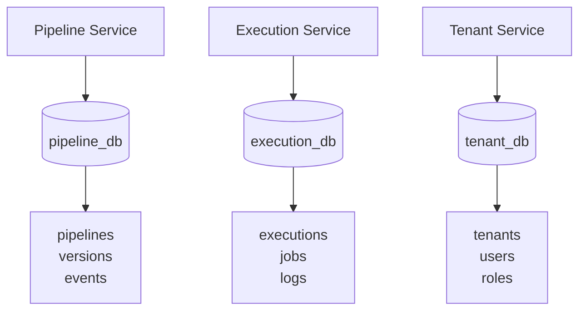

**Trade-offs:**
- ✅ Independence, clear ownership, scalability
- ❌ Cross-service queries require API calls, eventual consistency

**Interview Question:** "How do you query data across services?"
**Answer:** Never query another service's database. Use API calls or event-driven synchronization. For read-heavy cross-service queries, maintain a denormalized read model (CQRS).

---

## Resilience Patterns

### 11. Strangler Fig

**What:** Gradually replace a legacy system by routing traffic to new system piece by piece.

**Where:** Migration path from Airflow to Pravah

**Why:**
- Big-bang migration is risky
- Teams can migrate workflows incrementally
- Rollback is easy (route back to old system)

**How:**

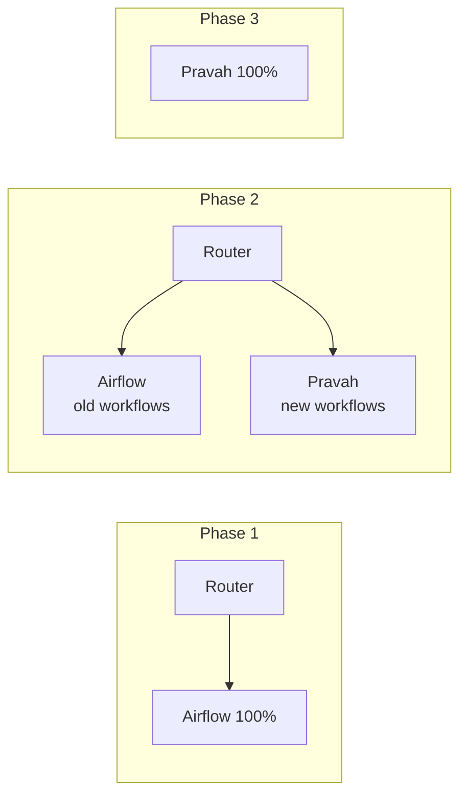

---

### 12. Sidecar

**What:** Deploy helper components alongside the main service container.

**Where:**
- Vault Agent sidecar — injects secrets
- Fluent Bit sidecar — ships logs

**Why:**
- Separation of concerns
- Main container stays focused on business logic
- Sidecars handle cross-cutting infrastructure concerns

**How:**

```yaml
# Kubernetes Pod
spec:
  containers:
  - name: pipeline-service        # Main container
    image: pravah/pipeline-service
    
  - name: vault-agent             # Sidecar: secrets
    image: vault:1.15
    
  - name: fluent-bit              # Sidecar: logging
    image: fluent/fluent-bit
```

---

### 13. Ambassador

**What:** Create a helper service that sends network requests on behalf of the main service.

**Where:** PgBouncer for database connection pooling

**Why:**
- Connection pooling without changing application code
- Single point for connection management
- Transparent to the application

---

### 14. Leader Election

**What:** Ensure only one instance performs a specific task at a time.

**Where:** Scheduler Service — only one instance should evaluate schedules

**Why:**
- Prevents duplicate schedule triggering
- Ensures exactly-once processing for singleton tasks

**How:**

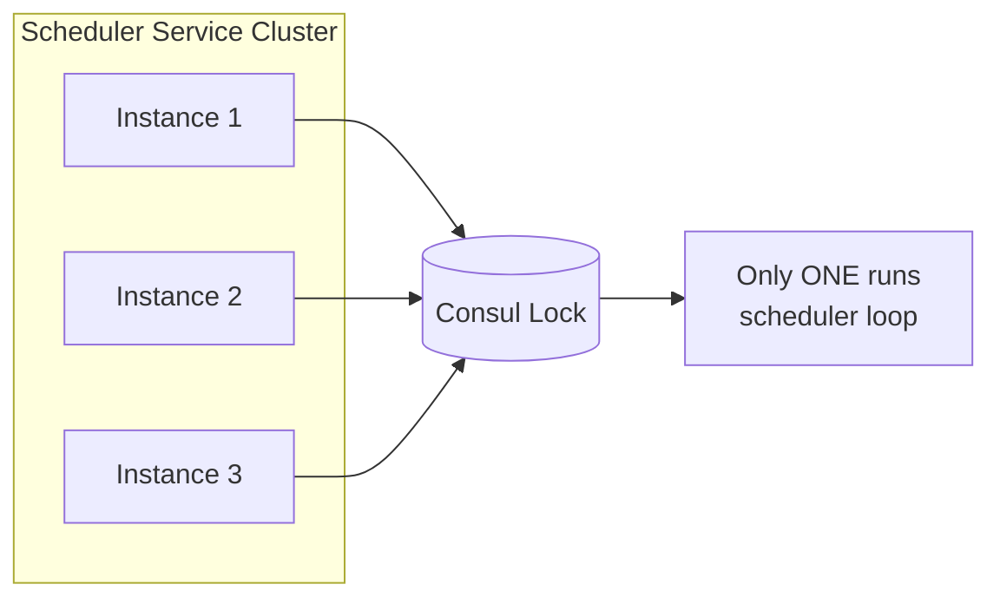

**Implementation:** Spring Cloud Kubernetes Leadership or Consul-based lock

---

## Messaging Patterns

### 15. Competing Consumers

**What:** Multiple consumers in a group share the load of processing messages from a queue/topic.

**Where:** All Kafka consumer groups

**Why:**
- Horizontal scaling of message processing
- Kafka partitions enable parallel processing
- Load balancing is automatic

**How:**

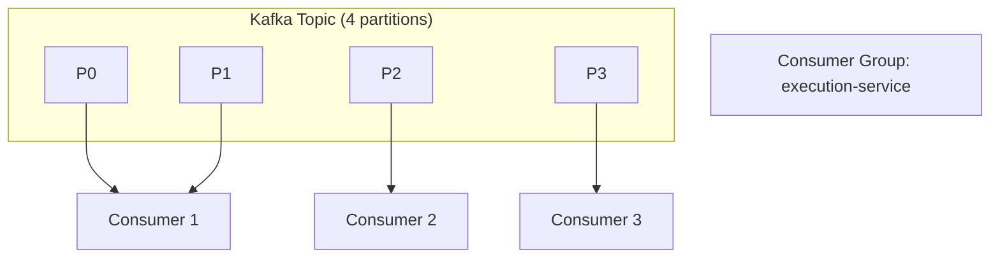

---

### 16. Idempotent Consumer

**What:** Design consumers to handle duplicate message delivery safely.

**Where:** All Kafka consumers

**Why:**
- Kafka guarantees at-least-once delivery (may deliver duplicates)
- Network issues can cause redelivery
- Consumer restarts may reprocess messages

**How:**

```java
@Transactional
public void handleJobCompleted(JobCompletedEvent event) {
    // Check if already processed
    if (processedEventRepository.exists(event.getEventId())) {
        log.info("Duplicate event {}, skipping", event.getEventId());
        return;
    }
    
    // Process the event
    executionService.markJobComplete(event);
    
    // Record as processed
    processedEventRepository.save(event.getEventId());
}
```

**Interview Question:** "How do you handle duplicate Kafka messages?"
**Answer:** Store processed event IDs. Before processing, check if ID exists. Use database transaction to atomically process + record. This makes consumers idempotent.

---

### 17. Dead Letter Queue

**What:** Move failed messages to a separate queue for analysis and retry.

**Where:** All Kafka consumers have DLT (Dead Letter Topic)

**Why:**
- Poison messages don't block the queue
- Failed messages can be analyzed
- Manual retry after fixing the issue

**How:**

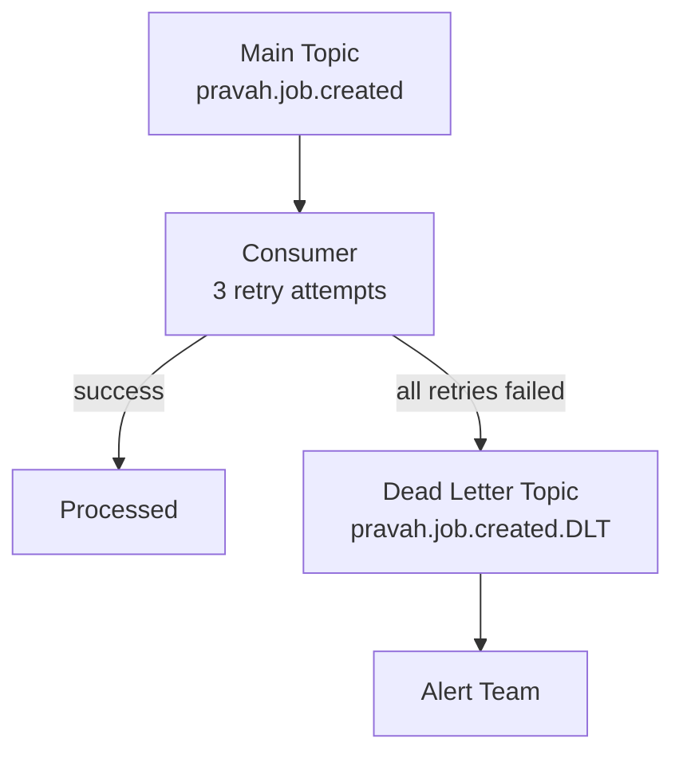

**Related ADR:** [ADR-002](../adr/ADR-002-kafka-event-backbone.md)

---

### 18. Claim Check

**What:** Store large payloads externally and pass only a reference in messages.

**Where:** Job artifacts, large log outputs

**Why:**
- Kafka has message size limits (default 1MB)
- Large messages slow down the broker
- Reference is small and fast

**How:**

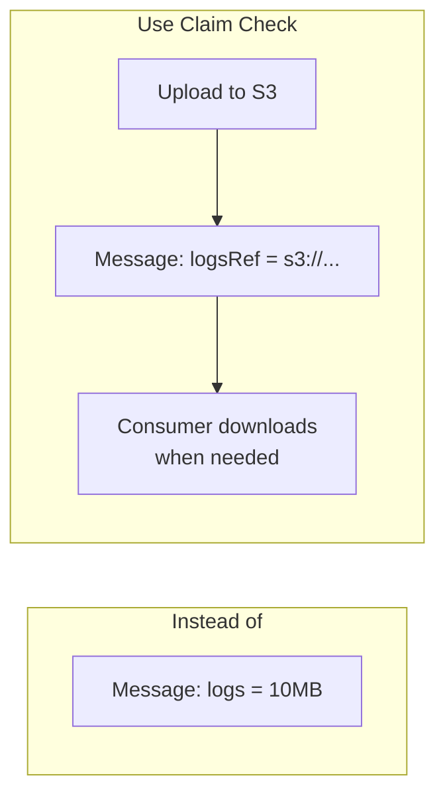

---

## Domain-Driven Design Patterns

### 19. Repository

**What:** Encapsulate data access logic. Domain layer works with repositories, not raw SQL.

**Where:** All services

**Why:**
- Testability (mock repositories in tests)
- Separation of concerns
- Domain logic doesn't know about persistence details

**How:**

```java
public interface PipelineRepository {
    Pipeline findById(PipelineId id);
    void save(Pipeline pipeline);
    List<Pipeline> findByTenantId(TenantId tenantId);
}

// Implementation uses JPA/JDBC
@Repository
public class JpaPipelineRepository implements PipelineRepository {
    // ...
}
```

---

### 20. Unit of Work

**What:** Track changes to objects during a business transaction and persist them together.

**Where:** Spring's `@Transactional`

**Why:**
- Atomic operations
- Automatic dirty checking
- Consistent state

---

### 21. Domain Events

**What:** Model significant occurrences in the domain as explicit event objects.

**Where:** Pipeline lifecycle (PipelineCreated, PipelineUpdated, PipelinePublished)

**Why:**
- Explicit about what happened
- Decouples domain from side effects
- Enables event sourcing

**How:**

```java
public sealed interface PipelineEvent {
    record Created(PipelineId id, String name, TenantId tenantId, Instant at) 
        implements PipelineEvent {}
    record Updated(PipelineId id, PipelineDefinition changes, Instant at) 
        implements PipelineEvent {}
    record Published(PipelineId id, int version, Instant at) 
        implements PipelineEvent {}
}
```

---

### 22. Aggregate Root

**What:** A cluster of domain objects treated as a single unit. All access goes through the root.

**Where:** Pipeline (root) → Steps, Schedules, Variables

**Why:**
- Consistency boundary
- Encapsulation
- Transaction boundary

**How:**

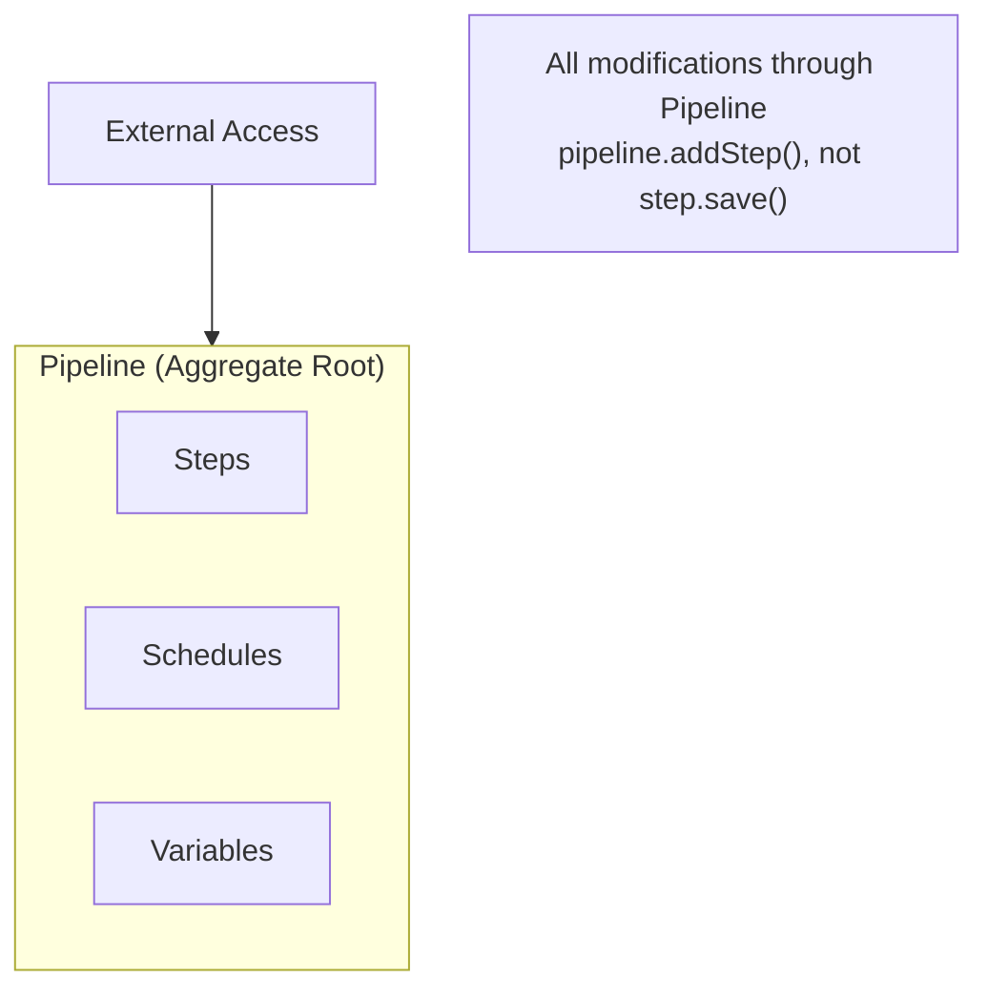

---

### 23. Value Object

**What:** Immutable objects defined by their attributes, not identity.

**Where:** CronExpression, PipelineVersion, TenantId

**Why:**
- Immutability prevents bugs
- Equality by value
- Self-validating

**How:**

```java
public record CronExpression(String expression) {
    public CronExpression {
        // Validation in compact constructor
        if (!CronParser.isValid(expression)) {
            throw new InvalidCronException(expression);
        }
    }
    
    public Instant nextExecution(Instant from) {
        return CronParser.next(expression, from);
    }
}
```

---

## Creational & Behavioral Patterns

### 24. Factory

**What:** Create objects without exposing creation logic.

**Where:** StageExecutorFactory — creates appropriate executor for stage type

**How:**

```java
@Component
public class StageExecutorFactory {
    public StageExecutor create(StageType type) {
        return switch (type) {
            case SQL -> new SqlStageExecutor();
            case PYTHON -> new PythonStageExecutor();
            case DBT -> new DbtStageExecutor();
            case CONTAINER -> new ContainerStageExecutor();
        };
    }
}
```

---

### 25. Strategy

**What:** Define a family of algorithms, encapsulate each one, make them interchangeable.

**Where:** Stage execution strategies, retry strategies

**How:**

```java
public interface RetryStrategy {
    Duration nextDelay(int attempt);
    boolean shouldRetry(int attempt, Throwable error);
}

public class ExponentialBackoff implements RetryStrategy { ... }
public class FixedDelay implements RetryStrategy { ... }
public class NoRetry implements RetryStrategy { ... }
```

---

### 26. Observer

**What:** Define a one-to-many dependency. When one object changes, all dependents are notified.

**Where:** Spring's `@EventListener` for domain events

**How:**

```java
@Component
public class AuditEventListener {
    @EventListener
    public void onPipelineCreated(PipelineCreatedEvent event) {
        auditLog.record(event);
    }
}
```

---

### 27. State Machine

**What:** Model object behavior that varies based on internal state.

**Where:** Execution states, Job states, Runner states

**Why:**
- Explicit state transitions
- Invalid transitions are compile-time errors
- Clear documentation of lifecycle

**How:**

See: [docs/lld/03-state-machines.md](./03-state-machines.md) for full diagrams

---

### 28. Template Method

**What:** Define skeleton of an algorithm, let subclasses override specific steps.

**Where:** BaseStageExecutor

**How:**

```java
public abstract class BaseStageExecutor {
    // Template method
    public final ExecutionResult execute(StageContext ctx) {
        validate(ctx);                    // Common
        ExecutionResult result = doExecute(ctx);  // Subclass implements
        recordMetrics(ctx, result);       // Common
        return result;
    }
    
    protected abstract ExecutionResult doExecute(StageContext ctx);
}
```

---

## Interview Tips

### Common Questions & Answers

**Q: "What patterns did you use in this project?"**
> Start with the top 3-4 most impactful: Event Sourcing, Transactional Outbox, Saga, CQRS. Explain *why* each was chosen.

**Q: "How do you ensure consistency in a distributed system?"**
> We don't use distributed transactions. Instead: Outbox pattern for DB+Kafka consistency, Saga for cross-service consistency, Idempotent consumers for duplicate handling.

**Q: "How do you handle failures?"**
> Multiple layers: Retry with backoff for transient failures, Circuit breaker to prevent cascading failures, Dead letter queue for poison messages, Saga compensation for business rollback.

**Q: "Why microservices? Why not monolith?"**
> Start monolith for simplicity, but Pravah is a platform that needs independent scaling (scheduler separate from execution), independent deployment (fix runner without touching pipeline service), and clear team ownership boundaries.

---

## Document History

| Version | Date | Author | Changes |
|---------|------|--------|---------|
| 1.0 | 2026-05-13 | Engineering | Initial catalog |
| 1.1 | 2026-05-13 | Engineering | Updated to Mermaid diagrams |
