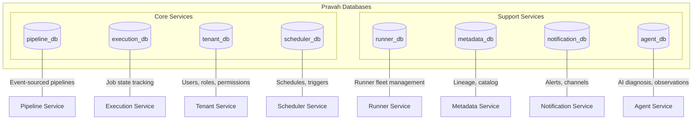
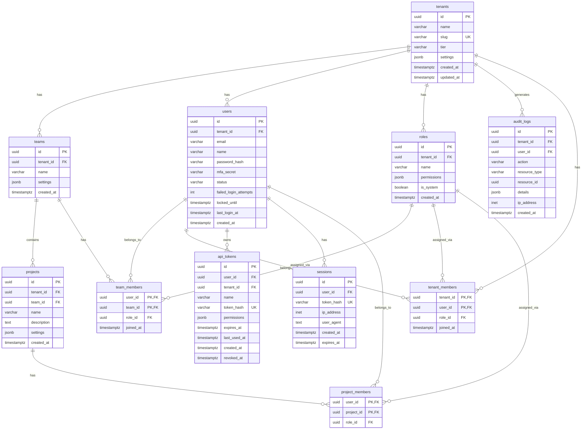
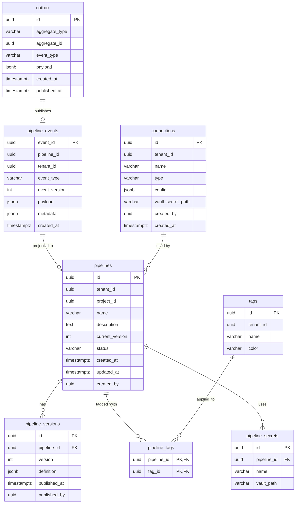
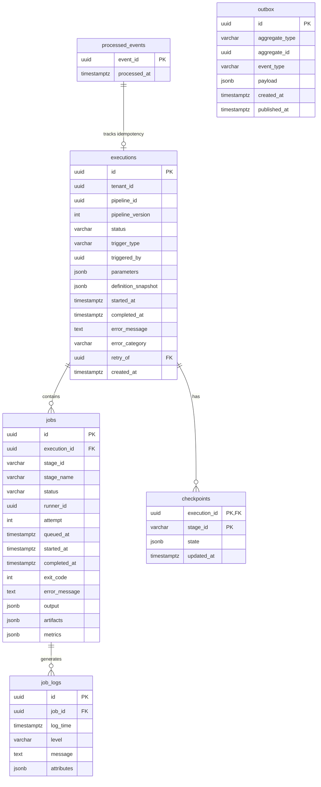
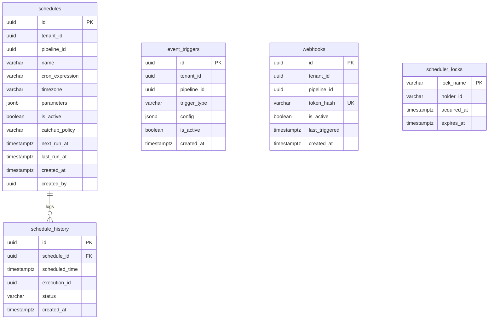
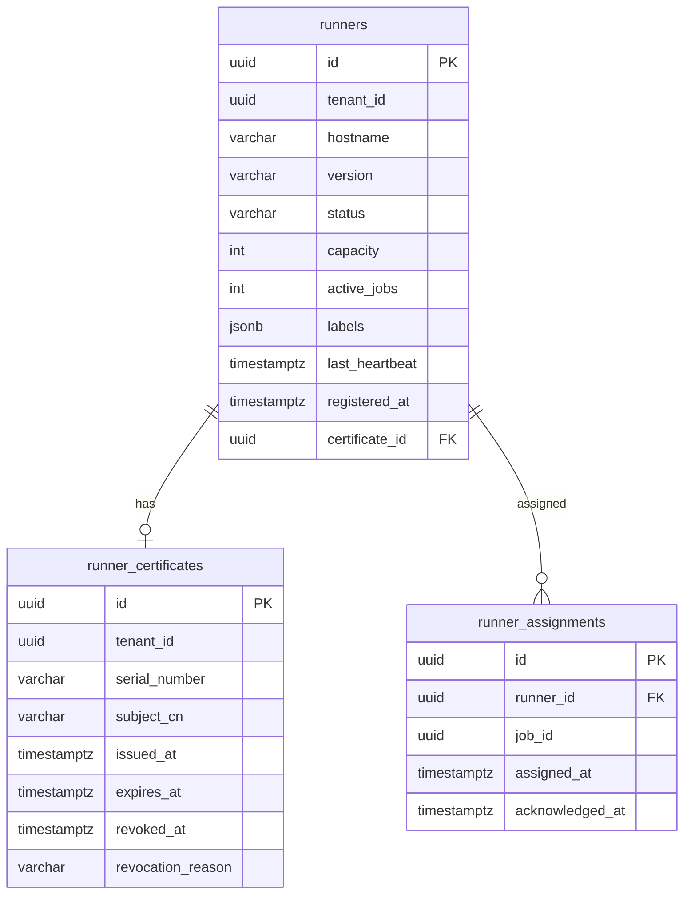
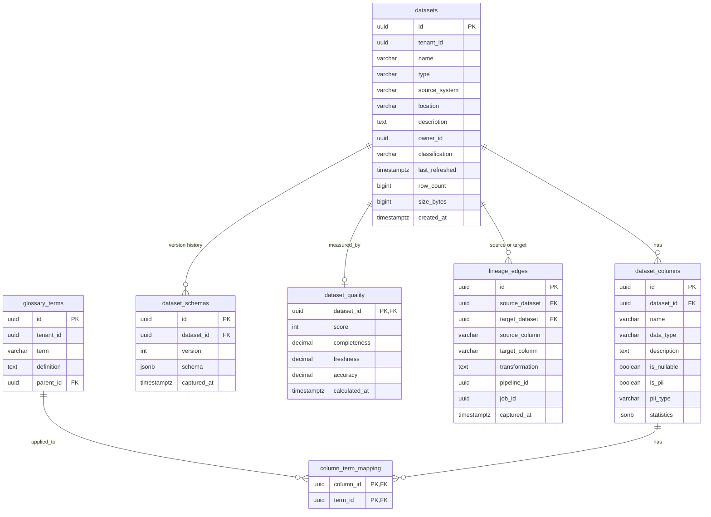
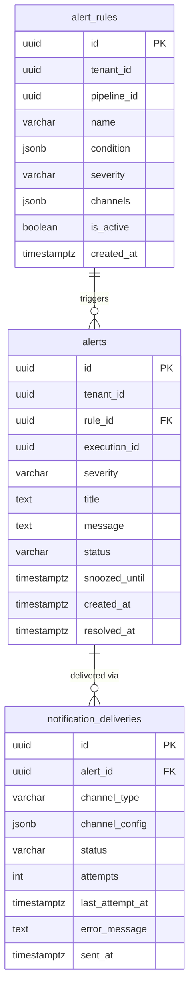
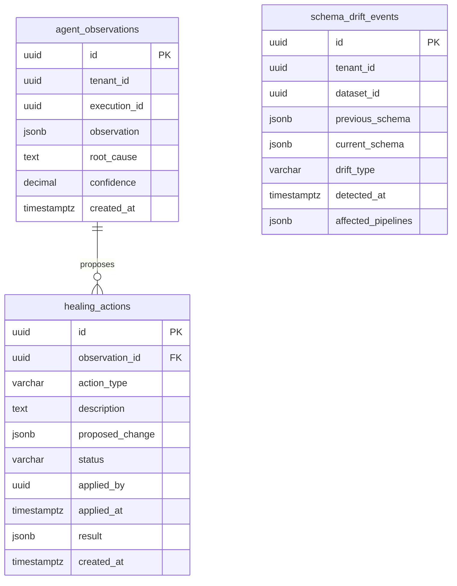

# Database Schema & ERD

Complete database schema for all Pravah services. Each service owns its database with Row-Level Security (RLS) for multi-tenancy.

---

## Database Overview



**All databases:**
- PostgreSQL 16
- RLS enabled for tenant isolation
- PgBouncer for connection pooling
- Flyway for migrations

---

## 1. Tenant Database (tenant_db)

### ERD



### Table Definitions

```sql
-- Tenants (top-level isolation boundary)
CREATE TABLE tenants (
    id              UUID PRIMARY KEY DEFAULT gen_random_uuid(),
    name            VARCHAR(255) NOT NULL,
    slug            VARCHAR(100) NOT NULL UNIQUE,
    tier            VARCHAR(50) NOT NULL DEFAULT 'free', -- free, team, enterprise
    settings        JSONB NOT NULL DEFAULT '{}',
    created_at      TIMESTAMPTZ NOT NULL DEFAULT now(),
    updated_at      TIMESTAMPTZ NOT NULL DEFAULT now(),
    
    CONSTRAINT chk_tier CHECK (tier IN ('free', 'team', 'enterprise')),
    CONSTRAINT chk_slug_format CHECK (slug ~ '^[a-z0-9]([a-z0-9-]{0,98}[a-z0-9])?$')
);

-- Teams within a tenant
CREATE TABLE teams (
    id              UUID PRIMARY KEY DEFAULT gen_random_uuid(),
    tenant_id       UUID NOT NULL REFERENCES tenants(id) ON DELETE CASCADE,
    name            VARCHAR(255) NOT NULL,
    description     TEXT,
    settings        JSONB NOT NULL DEFAULT '{}',
    created_at      TIMESTAMPTZ NOT NULL DEFAULT now(),
    
    UNIQUE(tenant_id, name)
);

-- Projects within a team
CREATE TABLE projects (
    id              UUID PRIMARY KEY DEFAULT gen_random_uuid(),
    tenant_id       UUID NOT NULL REFERENCES tenants(id) ON DELETE CASCADE,
    team_id         UUID NOT NULL REFERENCES teams(id) ON DELETE CASCADE,
    name            VARCHAR(255) NOT NULL,
    description     TEXT,
    settings        JSONB NOT NULL DEFAULT '{}',
    created_at      TIMESTAMPTZ NOT NULL DEFAULT now(),
    
    UNIQUE(team_id, name)
);

-- Users
CREATE TABLE users (
    id              UUID PRIMARY KEY DEFAULT gen_random_uuid(),
    tenant_id       UUID NOT NULL REFERENCES tenants(id) ON DELETE CASCADE,
    email           VARCHAR(255) NOT NULL,
    name            VARCHAR(255) NOT NULL,
    password_hash   VARCHAR(255), -- NULL for OAuth-only users
    mfa_secret      VARCHAR(255), -- TOTP secret, encrypted
    status          VARCHAR(50) NOT NULL DEFAULT 'pending', -- active, inactive, pending, locked
    failed_login_attempts INT NOT NULL DEFAULT 0,
    locked_until    TIMESTAMPTZ,
    last_login_at   TIMESTAMPTZ,
    created_at      TIMESTAMPTZ NOT NULL DEFAULT now(),
    updated_at      TIMESTAMPTZ NOT NULL DEFAULT now(),
    
    UNIQUE(tenant_id, email),
    CONSTRAINT chk_status CHECK (status IN ('active', 'inactive', 'pending', 'locked'))
);

-- Roles (system + custom)
CREATE TABLE roles (
    id              UUID PRIMARY KEY DEFAULT gen_random_uuid(),
    tenant_id       UUID REFERENCES tenants(id) ON DELETE CASCADE, -- NULL for system roles
    name            VARCHAR(100) NOT NULL,
    description     TEXT,
    permissions     JSONB NOT NULL DEFAULT '[]', -- array of permission strings
    is_system       BOOLEAN NOT NULL DEFAULT false,
    created_at      TIMESTAMPTZ NOT NULL DEFAULT now(),
    
    UNIQUE(tenant_id, name)
);

-- Insert system roles (tenant_id = NULL)
INSERT INTO roles (id, tenant_id, name, description, permissions, is_system) VALUES
    ('00000000-0000-0000-0000-000000000001', NULL, 'owner', 'Full access to tenant', '["*"]', true),
    ('00000000-0000-0000-0000-000000000002', NULL, 'admin', 'Administrative access', '["pipelines:*", "executions:*", "users:*", "settings:read"]', true),
    ('00000000-0000-0000-0000-000000000003', NULL, 'editor', 'Can create and modify pipelines', '["pipelines:read", "pipelines:write", "executions:*"]', true),
    ('00000000-0000-0000-0000-000000000004', NULL, 'viewer', 'Read-only access', '["pipelines:read", "executions:read"]', true);

-- Tenant membership (user-role assignment at tenant level)
CREATE TABLE tenant_members (
    tenant_id       UUID NOT NULL REFERENCES tenants(id) ON DELETE CASCADE,
    user_id         UUID NOT NULL REFERENCES users(id) ON DELETE CASCADE,
    role_id         UUID NOT NULL REFERENCES roles(id),
    joined_at       TIMESTAMPTZ NOT NULL DEFAULT now(),
    
    PRIMARY KEY (tenant_id, user_id)
);

-- Team membership
CREATE TABLE team_members (
    team_id         UUID NOT NULL REFERENCES teams(id) ON DELETE CASCADE,
    user_id         UUID NOT NULL REFERENCES users(id) ON DELETE CASCADE,
    role_id         UUID NOT NULL REFERENCES roles(id),
    joined_at       TIMESTAMPTZ NOT NULL DEFAULT now(),
    
    PRIMARY KEY (team_id, user_id)
);

-- Project membership (optional, for project-level access)
CREATE TABLE project_members (
    project_id      UUID NOT NULL REFERENCES projects(id) ON DELETE CASCADE,
    user_id         UUID NOT NULL REFERENCES users(id) ON DELETE CASCADE,
    role_id         UUID NOT NULL REFERENCES roles(id),
    
    PRIMARY KEY (project_id, user_id)
);

-- API tokens
CREATE TABLE api_tokens (
    id              UUID PRIMARY KEY DEFAULT gen_random_uuid(),
    tenant_id       UUID NOT NULL REFERENCES tenants(id) ON DELETE CASCADE,
    user_id         UUID NOT NULL REFERENCES users(id) ON DELETE CASCADE,
    name            VARCHAR(255) NOT NULL,
    token_hash      VARCHAR(255) NOT NULL UNIQUE, -- SHA-256 of token
    permissions     JSONB NOT NULL DEFAULT '[]', -- scoped permissions
    expires_at      TIMESTAMPTZ,
    last_used_at    TIMESTAMPTZ,
    created_at      TIMESTAMPTZ NOT NULL DEFAULT now(),
    revoked_at      TIMESTAMPTZ
);

-- User sessions
CREATE TABLE sessions (
    id              UUID PRIMARY KEY DEFAULT gen_random_uuid(),
    user_id         UUID NOT NULL REFERENCES users(id) ON DELETE CASCADE,
    token_hash      VARCHAR(255) NOT NULL UNIQUE,
    ip_address      INET,
    user_agent      TEXT,
    created_at      TIMESTAMPTZ NOT NULL DEFAULT now(),
    expires_at      TIMESTAMPTZ NOT NULL
);

-- Audit logs (append-only)
CREATE TABLE audit_logs (
    id              UUID PRIMARY KEY DEFAULT gen_random_uuid(),
    tenant_id       UUID NOT NULL REFERENCES tenants(id) ON DELETE CASCADE,
    user_id         UUID REFERENCES users(id) ON DELETE SET NULL, -- NULL for system actions
    action          VARCHAR(100) NOT NULL, -- e.g., 'pipeline.created'
    resource_type   VARCHAR(100) NOT NULL, -- e.g., 'pipeline'
    resource_id     UUID,
    details         JSONB NOT NULL DEFAULT '{}',
    ip_address      INET,
    user_agent      TEXT,
    created_at      TIMESTAMPTZ NOT NULL DEFAULT now()
);

-- Transactional outbox for event publishing
CREATE TABLE outbox (
    id              UUID PRIMARY KEY DEFAULT gen_random_uuid(),
    aggregate_type  VARCHAR(100) NOT NULL,
    aggregate_id    UUID NOT NULL,
    event_type      VARCHAR(100) NOT NULL,
    payload         JSONB NOT NULL,
    created_at      TIMESTAMPTZ NOT NULL DEFAULT now(),
    published_at    TIMESTAMPTZ
);

-- Indexes
CREATE INDEX idx_users_tenant_id ON users(tenant_id);
CREATE INDEX idx_users_email ON users(email);
CREATE INDEX idx_teams_tenant_id ON teams(tenant_id);
CREATE INDEX idx_projects_team_id ON projects(team_id);
CREATE INDEX idx_tenant_members_user ON tenant_members(user_id);
CREATE INDEX idx_team_members_user ON team_members(user_id);
CREATE INDEX idx_api_tokens_tenant ON api_tokens(tenant_id);
CREATE INDEX idx_api_tokens_user ON api_tokens(user_id);
CREATE INDEX idx_api_tokens_hash ON api_tokens(token_hash) WHERE revoked_at IS NULL;
CREATE INDEX idx_audit_logs_tenant_created ON audit_logs(tenant_id, created_at DESC);
CREATE INDEX idx_audit_logs_resource ON audit_logs(resource_type, resource_id);
CREATE INDEX idx_audit_logs_user ON audit_logs(user_id, created_at DESC);
CREATE INDEX idx_outbox_unpublished ON outbox(created_at) WHERE published_at IS NULL;

-- Row-Level Security (per ADR-013)
ALTER TABLE users ENABLE ROW LEVEL SECURITY;
ALTER TABLE users FORCE ROW LEVEL SECURITY;
ALTER TABLE teams ENABLE ROW LEVEL SECURITY;
ALTER TABLE teams FORCE ROW LEVEL SECURITY;
ALTER TABLE projects ENABLE ROW LEVEL SECURITY;
ALTER TABLE projects FORCE ROW LEVEL SECURITY;
ALTER TABLE tenant_members ENABLE ROW LEVEL SECURITY;
ALTER TABLE tenant_members FORCE ROW LEVEL SECURITY;
ALTER TABLE team_members ENABLE ROW LEVEL SECURITY;
ALTER TABLE team_members FORCE ROW LEVEL SECURITY;
ALTER TABLE api_tokens ENABLE ROW LEVEL SECURITY;
ALTER TABLE api_tokens FORCE ROW LEVEL SECURITY;
ALTER TABLE audit_logs ENABLE ROW LEVEL SECURITY;
ALTER TABLE audit_logs FORCE ROW LEVEL SECURITY;

CREATE POLICY tenant_isolation_users ON users FOR ALL
    USING (tenant_id = current_setting('pravah.current_tenant_id', true)::UUID)
    WITH CHECK (tenant_id = current_setting('pravah.current_tenant_id', true)::UUID);
CREATE POLICY tenant_isolation_teams ON teams FOR ALL
    USING (tenant_id = current_setting('pravah.current_tenant_id', true)::UUID)
    WITH CHECK (tenant_id = current_setting('pravah.current_tenant_id', true)::UUID);
CREATE POLICY tenant_isolation_projects ON projects FOR ALL
    USING (tenant_id = current_setting('pravah.current_tenant_id', true)::UUID)
    WITH CHECK (tenant_id = current_setting('pravah.current_tenant_id', true)::UUID);
CREATE POLICY tenant_isolation_tenant_members ON tenant_members FOR ALL
    USING (tenant_id = current_setting('pravah.current_tenant_id', true)::UUID)
    WITH CHECK (tenant_id = current_setting('pravah.current_tenant_id', true)::UUID);
CREATE POLICY tenant_isolation_team_members ON team_members FOR ALL
    USING (team_id IN (
        SELECT id FROM teams WHERE tenant_id = current_setting('pravah.current_tenant_id', true)::UUID
    ));
CREATE POLICY tenant_isolation_api_tokens ON api_tokens FOR ALL
    USING (tenant_id = current_setting('pravah.current_tenant_id', true)::UUID)
    WITH CHECK (tenant_id = current_setting('pravah.current_tenant_id', true)::UUID);
CREATE POLICY tenant_isolation_audit ON audit_logs FOR ALL
    USING (tenant_id = current_setting('pravah.current_tenant_id', true)::UUID)
    WITH CHECK (tenant_id = current_setting('pravah.current_tenant_id', true)::UUID);
```

---

## 2. Pipeline Database (pipeline_db)

### ERD



### Table Definitions

```sql
-- Event store (source of truth)
CREATE TABLE pipeline_events (
    event_id        UUID PRIMARY KEY DEFAULT gen_random_uuid(),
    pipeline_id     UUID NOT NULL,
    tenant_id       UUID NOT NULL,
    event_type      VARCHAR(50) NOT NULL,
    event_version   INT NOT NULL, -- for optimistic locking
    payload         JSONB NOT NULL,
    metadata        JSONB NOT NULL DEFAULT '{}',
    created_at      TIMESTAMPTZ NOT NULL DEFAULT now(),
    
    -- Ensure sequential versioning per pipeline
    UNIQUE(pipeline_id, event_version)
);

-- Read model (projected from events)
CREATE TABLE pipelines (
    id              UUID PRIMARY KEY,
    tenant_id       UUID NOT NULL,
    project_id      UUID NOT NULL,
    name            VARCHAR(255) NOT NULL,
    description     TEXT,
    current_version INT NOT NULL DEFAULT 0,
    status          VARCHAR(50) NOT NULL DEFAULT 'draft',
    created_at      TIMESTAMPTZ NOT NULL,
    updated_at      TIMESTAMPTZ NOT NULL,
    created_by      UUID NOT NULL,
    
    UNIQUE(project_id, name)
);

-- Immutable published versions
CREATE TABLE pipeline_versions (
    id              UUID PRIMARY KEY DEFAULT gen_random_uuid(),
    pipeline_id     UUID NOT NULL REFERENCES pipelines(id),
    version         INT NOT NULL,
    definition      JSONB NOT NULL, -- complete pipeline definition
    published_at    TIMESTAMPTZ NOT NULL DEFAULT now(),
    published_by    UUID NOT NULL,
    
    UNIQUE(pipeline_id, version)
);

-- Tags for organization
CREATE TABLE tags (
    id              UUID PRIMARY KEY DEFAULT gen_random_uuid(),
    tenant_id       UUID NOT NULL,
    name            VARCHAR(100) NOT NULL,
    color           VARCHAR(7), -- hex color
    
    UNIQUE(tenant_id, name)
);

CREATE TABLE pipeline_tags (
    pipeline_id     UUID NOT NULL REFERENCES pipelines(id),
    tag_id          UUID NOT NULL REFERENCES tags(id),
    
    PRIMARY KEY (pipeline_id, tag_id)
);

-- Connections to external systems
CREATE TABLE connections (
    id              UUID PRIMARY KEY DEFAULT gen_random_uuid(),
    tenant_id       UUID NOT NULL,
    name            VARCHAR(255) NOT NULL,
    type            VARCHAR(100) NOT NULL, -- snowflake, bigquery, postgres, s3, etc.
    config          JSONB NOT NULL, -- non-sensitive config
    vault_secret_path VARCHAR(500), -- path in Vault for credentials
    created_by      UUID NOT NULL,
    created_at      TIMESTAMPTZ NOT NULL DEFAULT now(),
    
    UNIQUE(tenant_id, name)
);

-- Pipeline secret references
CREATE TABLE pipeline_secrets (
    id              UUID PRIMARY KEY DEFAULT gen_random_uuid(),
    pipeline_id     UUID NOT NULL REFERENCES pipelines(id),
    name            VARCHAR(255) NOT NULL, -- reference name in pipeline
    vault_path      VARCHAR(500) NOT NULL, -- actual Vault path
    
    UNIQUE(pipeline_id, name)
);

-- Transactional outbox
CREATE TABLE outbox (
    id              UUID PRIMARY KEY DEFAULT gen_random_uuid(),
    aggregate_type  VARCHAR(100) NOT NULL,
    aggregate_id    UUID NOT NULL,
    event_type      VARCHAR(100) NOT NULL,
    payload         JSONB NOT NULL,
    created_at      TIMESTAMPTZ NOT NULL DEFAULT now(),
    published_at    TIMESTAMPTZ -- NULL until published
);

-- Indexes
CREATE INDEX idx_pipeline_events_pipeline ON pipeline_events(pipeline_id, event_version);
CREATE INDEX idx_pipeline_events_tenant ON pipeline_events(tenant_id, created_at DESC);
CREATE INDEX idx_pipelines_project ON pipelines(project_id);
CREATE INDEX idx_pipelines_tenant_status ON pipelines(tenant_id, status);
CREATE INDEX idx_outbox_unpublished ON outbox(created_at) WHERE published_at IS NULL;

-- RLS (per ADR-013)
ALTER TABLE pipelines ENABLE ROW LEVEL SECURITY;
ALTER TABLE pipelines FORCE ROW LEVEL SECURITY;
ALTER TABLE pipeline_events ENABLE ROW LEVEL SECURITY;
ALTER TABLE pipeline_events FORCE ROW LEVEL SECURITY;
ALTER TABLE connections ENABLE ROW LEVEL SECURITY;
ALTER TABLE connections FORCE ROW LEVEL SECURITY;

CREATE POLICY tenant_isolation_pipelines ON pipelines FOR ALL
    USING (tenant_id = current_setting('pravah.current_tenant_id', true)::UUID)
    WITH CHECK (tenant_id = current_setting('pravah.current_tenant_id', true)::UUID);
CREATE POLICY tenant_isolation_events ON pipeline_events FOR ALL
    USING (tenant_id = current_setting('pravah.current_tenant_id', true)::UUID)
    WITH CHECK (tenant_id = current_setting('pravah.current_tenant_id', true)::UUID);
CREATE POLICY tenant_isolation_connections ON connections FOR ALL
    USING (tenant_id = current_setting('pravah.current_tenant_id', true)::UUID)
    WITH CHECK (tenant_id = current_setting('pravah.current_tenant_id', true)::UUID);
```

### Pipeline Definition JSON Schema

```json
{
  "name": "daily_sales_etl",
  "description": "Load sales data from Snowflake, transform, load to warehouse",
  "stages": [
    {
      "id": "extract",
      "name": "Extract Sales",
      "type": "sql",
      "config": {
        "connection": "snowflake_prod",
        "query": "SELECT * FROM sales WHERE date = '${date}'"
      },
      "depends_on": []
    },
    {
      "id": "transform",
      "name": "Transform Sales",
      "type": "python",
      "config": {
        "script": "transform_sales.py",
        "requirements": ["pandas==2.0.0"]
      },
      "depends_on": ["extract"]
    },
    {
      "id": "load",
      "name": "Load to Warehouse",
      "type": "sql",
      "config": {
        "connection": "bigquery_prod",
        "query": "INSERT INTO sales_mart SELECT * FROM ${transform.output}"
      },
      "depends_on": ["transform"]
    }
  ],
  "variables": {
    "date": {
      "type": "string",
      "default": "${execution_date}"
    }
  },
  "retry": {
    "max_attempts": 3,
    "backoff_multiplier": 2
  },
  "timeout_minutes": 60
}
```

---

## 3. Execution Database (execution_db)

### ERD



### Table Definitions

```sql
-- Execution (one run of a pipeline)
CREATE TABLE executions (
    id              UUID PRIMARY KEY DEFAULT gen_random_uuid(),
    tenant_id       UUID NOT NULL,
    pipeline_id     UUID NOT NULL,
    pipeline_version INT NOT NULL,
    status          VARCHAR(50) NOT NULL DEFAULT 'pending',
    trigger_type    VARCHAR(50) NOT NULL,
    triggered_by    UUID, -- user_id, NULL for scheduled/event
    parameters      JSONB NOT NULL DEFAULT '{}',
    definition_snapshot JSONB, -- pipeline definition at run time (DAG scheduling)
    started_at      TIMESTAMPTZ,
    completed_at    TIMESTAMPTZ,
    error_message   TEXT,
    error_category  VARCHAR(50),
    retry_of        UUID REFERENCES executions(id),
    created_at      TIMESTAMPTZ NOT NULL DEFAULT now()
);

-- Jobs (one stage execution within a run)
CREATE TABLE jobs (
    id              UUID PRIMARY KEY DEFAULT gen_random_uuid(),
    execution_id    UUID NOT NULL REFERENCES executions(id),
    stage_id        VARCHAR(255) NOT NULL,
    stage_name      VARCHAR(255) NOT NULL,
    status          VARCHAR(50) NOT NULL DEFAULT 'pending',
    runner_id       UUID,
    attempt         INT NOT NULL DEFAULT 1,
    queued_at       TIMESTAMPTZ,
    started_at      TIMESTAMPTZ,
    completed_at    TIMESTAMPTZ,
    exit_code       INT,
    error_message   TEXT,
    output          JSONB,
    artifacts       JSONB, -- {"logs": "s3://...", "result": "s3://..."}
    metrics         JSONB, -- {"cpu_seconds": 120, "memory_mb": 512}
    
    UNIQUE(execution_id, stage_id, attempt)
);

-- Job logs (partitioned for performance)
CREATE TABLE job_logs (
    id              UUID NOT NULL DEFAULT gen_random_uuid(),
    job_id          UUID NOT NULL,
    log_time        TIMESTAMPTZ NOT NULL,
    level           VARCHAR(10) NOT NULL,
    message         TEXT NOT NULL,
    attributes      JSONB
) PARTITION BY RANGE (log_time);

-- Create partitions for logs (example: monthly)
CREATE TABLE job_logs_2026_05 PARTITION OF job_logs
    FOR VALUES FROM ('2026-05-01') TO ('2026-06-01');
CREATE TABLE job_logs_2026_06 PARTITION OF job_logs
    FOR VALUES FROM ('2026-06-01') TO ('2026-07-01');

-- Checkpoints for resumable execution
CREATE TABLE checkpoints (
    execution_id    UUID NOT NULL,
    stage_id        VARCHAR(255) NOT NULL,
    state           JSONB NOT NULL,
    updated_at      TIMESTAMPTZ NOT NULL DEFAULT now(),
    
    PRIMARY KEY (execution_id, stage_id)
);

-- Idempotency tracking
CREATE TABLE processed_events (
    event_id        UUID PRIMARY KEY,
    processed_at    TIMESTAMPTZ NOT NULL DEFAULT now()
);

-- Outbox
CREATE TABLE outbox (
    id              UUID PRIMARY KEY DEFAULT gen_random_uuid(),
    aggregate_type  VARCHAR(100) NOT NULL,
    aggregate_id    UUID NOT NULL,
    event_type      VARCHAR(100) NOT NULL,
    payload         JSONB NOT NULL,
    created_at      TIMESTAMPTZ NOT NULL DEFAULT now(),
    published_at    TIMESTAMPTZ
);

-- Indexes
CREATE INDEX idx_executions_tenant_status ON executions(tenant_id, status);
CREATE INDEX idx_executions_pipeline ON executions(pipeline_id, created_at DESC);
CREATE INDEX idx_executions_created ON executions(created_at DESC);
CREATE INDEX idx_jobs_execution ON jobs(execution_id);
CREATE INDEX idx_jobs_runner ON jobs(runner_id, status) WHERE status IN ('queued', 'running');
CREATE INDEX idx_job_logs_job ON job_logs(job_id, log_time);
CREATE INDEX idx_outbox_unpublished ON outbox(created_at) WHERE published_at IS NULL;

-- RLS (per ADR-013)
ALTER TABLE executions ENABLE ROW LEVEL SECURITY;
ALTER TABLE executions FORCE ROW LEVEL SECURITY;
ALTER TABLE jobs ENABLE ROW LEVEL SECURITY;
ALTER TABLE jobs FORCE ROW LEVEL SECURITY;

CREATE POLICY tenant_isolation_executions ON executions FOR ALL
    USING (tenant_id = current_setting('pravah.current_tenant_id', true)::UUID)
    WITH CHECK (tenant_id = current_setting('pravah.current_tenant_id', true)::UUID);
-- Jobs inherit tenant from execution via FK constraint
```

---

## 4. Scheduler Database (scheduler_db)

### ERD



### Table Definitions

```sql
-- Cron schedules
CREATE TABLE schedules (
    id              UUID PRIMARY KEY DEFAULT gen_random_uuid(),
    tenant_id       UUID NOT NULL,
    pipeline_id     UUID NOT NULL,
    name            VARCHAR(255),
    cron_expression VARCHAR(100) NOT NULL,
    timezone        VARCHAR(100) NOT NULL DEFAULT 'UTC',
    parameters      JSONB NOT NULL DEFAULT '{}',
    is_active       BOOLEAN NOT NULL DEFAULT true,
    catchup_policy  VARCHAR(50) NOT NULL DEFAULT 'skip',
    next_run_at     TIMESTAMPTZ,
    last_run_at     TIMESTAMPTZ,
    created_at      TIMESTAMPTZ NOT NULL DEFAULT now(),
    created_by      UUID NOT NULL
);

-- Event-based triggers
CREATE TABLE event_triggers (
    id              UUID PRIMARY KEY DEFAULT gen_random_uuid(),
    tenant_id       UUID NOT NULL,
    pipeline_id     UUID NOT NULL,
    trigger_type    VARCHAR(50) NOT NULL, -- kafka, webhook, file_sensor, partition_sensor
    config          JSONB NOT NULL,
    is_active       BOOLEAN NOT NULL DEFAULT true,
    created_at      TIMESTAMPTZ NOT NULL DEFAULT now()
);

-- Webhook endpoints
CREATE TABLE webhooks (
    id              UUID PRIMARY KEY DEFAULT gen_random_uuid(),
    tenant_id       UUID NOT NULL,
    pipeline_id     UUID NOT NULL,
    token_hash      VARCHAR(255) NOT NULL UNIQUE,
    is_active       BOOLEAN NOT NULL DEFAULT true,
    last_triggered  TIMESTAMPTZ,
    created_at      TIMESTAMPTZ NOT NULL DEFAULT now()
);

-- Schedule execution history
CREATE TABLE schedule_history (
    id              UUID PRIMARY KEY DEFAULT gen_random_uuid(),
    schedule_id     UUID NOT NULL REFERENCES schedules(id),
    scheduled_time  TIMESTAMPTZ NOT NULL,
    execution_id    UUID,
    status          VARCHAR(50) NOT NULL,
    created_at      TIMESTAMPTZ NOT NULL DEFAULT now()
);

-- Leader election
CREATE TABLE scheduler_locks (
    lock_name       VARCHAR(100) PRIMARY KEY,
    holder_id       VARCHAR(255) NOT NULL,
    acquired_at     TIMESTAMPTZ NOT NULL DEFAULT now(),
    expires_at      TIMESTAMPTZ NOT NULL
);

-- Indexes
CREATE INDEX idx_schedules_next_run ON schedules(next_run_at) WHERE is_active = true;
CREATE INDEX idx_schedules_tenant ON schedules(tenant_id);
CREATE INDEX idx_event_triggers_tenant ON event_triggers(tenant_id);
CREATE INDEX idx_webhooks_token ON webhooks(token_hash);

-- RLS (per ADR-013)
ALTER TABLE schedules ENABLE ROW LEVEL SECURITY;
ALTER TABLE schedules FORCE ROW LEVEL SECURITY;
ALTER TABLE event_triggers ENABLE ROW LEVEL SECURITY;
ALTER TABLE event_triggers FORCE ROW LEVEL SECURITY;
ALTER TABLE webhooks ENABLE ROW LEVEL SECURITY;
ALTER TABLE webhooks FORCE ROW LEVEL SECURITY;

CREATE POLICY tenant_isolation_schedules ON schedules FOR ALL
    USING (tenant_id = current_setting('pravah.current_tenant_id', true)::UUID)
    WITH CHECK (tenant_id = current_setting('pravah.current_tenant_id', true)::UUID);
CREATE POLICY tenant_isolation_triggers ON event_triggers FOR ALL
    USING (tenant_id = current_setting('pravah.current_tenant_id', true)::UUID)
    WITH CHECK (tenant_id = current_setting('pravah.current_tenant_id', true)::UUID);
CREATE POLICY tenant_isolation_webhooks ON webhooks FOR ALL
    USING (tenant_id = current_setting('pravah.current_tenant_id', true)::UUID)
    WITH CHECK (tenant_id = current_setting('pravah.current_tenant_id', true)::UUID);
```

---

## 5. Runner Database (runner_db)

### ERD



**Note:** Runner heartbeats and real-time capacity are stored in Redis (30s TTL) for performance. The database stores persistent state only.

---

## 6. Metadata Database (metadata_db)

### ERD



---

## 7. Notification Database (notification_db)

### ERD



### Table Definitions

```sql
-- Alert rules
CREATE TABLE alert_rules (
    id              UUID PRIMARY KEY DEFAULT gen_random_uuid(),
    tenant_id       UUID NOT NULL,
    pipeline_id     UUID, -- NULL for global rules
    name            VARCHAR(255) NOT NULL,
    condition       JSONB NOT NULL, -- {"type": "failure"} or {"type": "sla", "threshold_minutes": 60}
    severity        VARCHAR(50) NOT NULL, -- info, warning, critical
    channels        JSONB NOT NULL, -- [{"type": "slack", "webhook": "..."}, {"type": "email", "to": [...]}]
    is_active       BOOLEAN NOT NULL DEFAULT true,
    created_at      TIMESTAMPTZ NOT NULL DEFAULT now()
);

-- Alert history
CREATE TABLE alerts (
    id              UUID PRIMARY KEY DEFAULT gen_random_uuid(),
    tenant_id       UUID NOT NULL,
    rule_id         UUID REFERENCES alert_rules(id),
    execution_id    UUID,
    severity        VARCHAR(50) NOT NULL,
    title           TEXT NOT NULL,
    message         TEXT NOT NULL,
    status          VARCHAR(50) NOT NULL DEFAULT 'active', -- active, acknowledged, resolved, snoozed
    snoozed_until   TIMESTAMPTZ,
    created_at      TIMESTAMPTZ NOT NULL DEFAULT now(),
    resolved_at     TIMESTAMPTZ
);

-- Notification delivery
CREATE TABLE notification_deliveries (
    id              UUID PRIMARY KEY DEFAULT gen_random_uuid(),
    alert_id        UUID NOT NULL REFERENCES alerts(id),
    channel_type    VARCHAR(50) NOT NULL,
    channel_config  JSONB NOT NULL,
    status          VARCHAR(50) NOT NULL, -- pending, sent, failed
    attempts        INT NOT NULL DEFAULT 0,
    last_attempt_at TIMESTAMPTZ,
    error_message   TEXT,
    sent_at         TIMESTAMPTZ
);
```

---

## 8. Agent Database (agent_db)

### ERD



### Table Definitions

```sql
-- Agent observations (AI diagnosis attempts)
CREATE TABLE agent_observations (
    id              UUID PRIMARY KEY DEFAULT gen_random_uuid(),
    tenant_id       UUID NOT NULL,
    execution_id    UUID NOT NULL,
    observation     JSONB NOT NULL, -- full agent reasoning chain
    root_cause      TEXT,
    confidence      DECIMAL(3,2), -- 0.00 to 1.00
    created_at      TIMESTAMPTZ NOT NULL DEFAULT now()
);

-- Healing actions (suggested and applied fixes)
CREATE TABLE healing_actions (
    id              UUID PRIMARY KEY DEFAULT gen_random_uuid(),
    observation_id  UUID REFERENCES agent_observations(id),
    action_type     VARCHAR(100) NOT NULL, -- schema_fix, retry, config_update
    description     TEXT NOT NULL,
    proposed_change JSONB, -- the actual change
    status          VARCHAR(50) NOT NULL DEFAULT 'proposed', -- proposed, approved, applied, rejected
    applied_by      UUID,
    applied_at      TIMESTAMPTZ,
    result          JSONB,
    created_at      TIMESTAMPTZ NOT NULL DEFAULT now()
);

-- Schema drift events
CREATE TABLE schema_drift_events (
    id              UUID PRIMARY KEY DEFAULT gen_random_uuid(),
    tenant_id       UUID NOT NULL,
    dataset_id      UUID NOT NULL,
    previous_schema JSONB NOT NULL,
    current_schema  JSONB NOT NULL,
    drift_type      VARCHAR(50) NOT NULL, -- column_added, column_removed, type_changed
    detected_at     TIMESTAMPTZ NOT NULL DEFAULT now(),
    affected_pipelines JSONB -- list of pipeline IDs
);
```

---

## Multi-Tenancy Pattern

### Row-Level Security (RLS) Implementation

All tables with tenant data implement RLS per [ADR-013](../../adr/013-tenant-isolation.md):

```sql
-- 1. Enable and force RLS on table (force ensures even table owners obey RLS)
ALTER TABLE pipelines ENABLE ROW LEVEL SECURITY;
ALTER TABLE pipelines FORCE ROW LEVEL SECURITY;

-- 2. Create policy with both read (USING) and write (WITH CHECK) controls
CREATE POLICY tenant_isolation ON pipelines
    FOR ALL
    USING (tenant_id = current_setting('pravah.current_tenant_id', true)::UUID)
    WITH CHECK (tenant_id = current_setting('pravah.current_tenant_id', true)::UUID);

-- 3. Application sets tenant context within transaction scope
SET LOCAL pravah.current_tenant_id = 'tenant-uuid-here';

-- 4. All subsequent queries automatically filtered
SELECT * FROM pipelines; -- Only returns current tenant's pipelines
-- INSERT/UPDATE also validated by WITH CHECK clause
```

### RLS Context Setup (Java/Spring)

Per ADR-013, we use a simple `@Aspect` to set the RLS context at the start of each transaction:

```java
@Aspect
@Component
@RequiredArgsConstructor
public class RlsAspect {

    private final EntityManager entityManager;

    @Before("@annotation(org.springframework.transaction.annotation.Transactional)")
    public void setRlsContext() {
        UUID tenantId = TenantContext.getCurrentTenantId();
        
        if (tenantId == null) {
            // Per ADR-013: if no tenant context, RLS returns zero rows
            log.warn("No tenant context set - RLS will return empty results");
            return;
        }
        
        // Use parameterized query to prevent SQL injection
        entityManager.createNativeQuery("SET LOCAL pravah.current_tenant_id = :tenantId")
            .setParameter("tenantId", tenantId.toString())
            .executeUpdate();
    }
}
```

The `TenantContext` is populated by a servlet filter that extracts tenant ID from the JWT:

```java
@Component
public class TenantFilter extends OncePerRequestFilter {
    
    @Override
    protected void doFilterInternal(HttpServletRequest request, ...) {
        String tenantId = extractTenantIdFromJwt(request);
        if (tenantId != null) {
            TenantContext.setCurrentTenantId(UUID.fromString(tenantId));
        }
        try {
            filterChain.doFilter(request, response);
        } finally {
            TenantContext.clear();
        }
    }
}
```

---

## Indexing Strategy

### Primary Access Patterns

| Query Pattern | Table | Index |
|---------------|-------|-------|
| Pipelines by project | pipelines | `(project_id)` |
| Executions by pipeline | executions | `(pipeline_id, created_at DESC)` |
| Active executions | executions | `(status) WHERE status IN ('pending', 'running')` |
| Jobs by runner | jobs | `(runner_id, status)` |
| Due schedules | schedules | `(next_run_at) WHERE is_active = true` |
| Lineage lookup | lineage_edges | `(source_dataset)`, `(target_dataset)` |
| Audit by resource | audit_logs | `(resource_type, resource_id)` |

### Partial Indexes

```sql
-- Only index active executions (most queries filter by status)
CREATE INDEX idx_executions_active ON executions(tenant_id, created_at)
    WHERE status IN ('pending', 'running');

-- Only index unpublished outbox entries
CREATE INDEX idx_outbox_pending ON outbox(created_at)
    WHERE published_at IS NULL;
```

---

## Interview Questions

**Q: "How do you handle multi-tenancy?"**
> PostgreSQL Row-Level Security per [ADR-013](../../adr/013-tenant-isolation.md). Each table has a `tenant_id` column with `ENABLE ROW LEVEL SECURITY` + `FORCE ROW LEVEL SECURITY`. RLS policies use `current_setting('pravah.current_tenant_id', true)::UUID` with both `USING` (read) and `WITH CHECK` (write) clauses. The application's `RlsAspect` sets this within each `@Transactional` method via `SET LOCAL`, ensuring transaction-scoped isolation.

**Q: "Why event sourcing for pipelines?"**
> Three reasons: (1) Complete audit trail for compliance, (2) Time-travel debugging — "what was this pipeline last week?", (3) Agent Service needs full history to reason about failure patterns.

**Q: "How do you handle schema migrations in production?"**
> Flyway with backward-compatible migrations. Add columns as nullable, populate in batches, then add NOT NULL constraint. Never drop columns in production — mark deprecated, remove in next major version.

**Q: "How do you scale the database?"**
> Read replicas for read-heavy workloads. Table partitioning for large tables (job_logs by date). Connection pooling via PgBouncer. Each service has its own database — no cross-database queries.

---

## Document History

| Version | Date | Author | Changes |
|---------|------|--------|---------|
| 1.0 | 2026-05-13 | Engineering | Initial schema |
| 1.1 | 2026-05-13 | Engineering | Updated to Mermaid diagrams |
