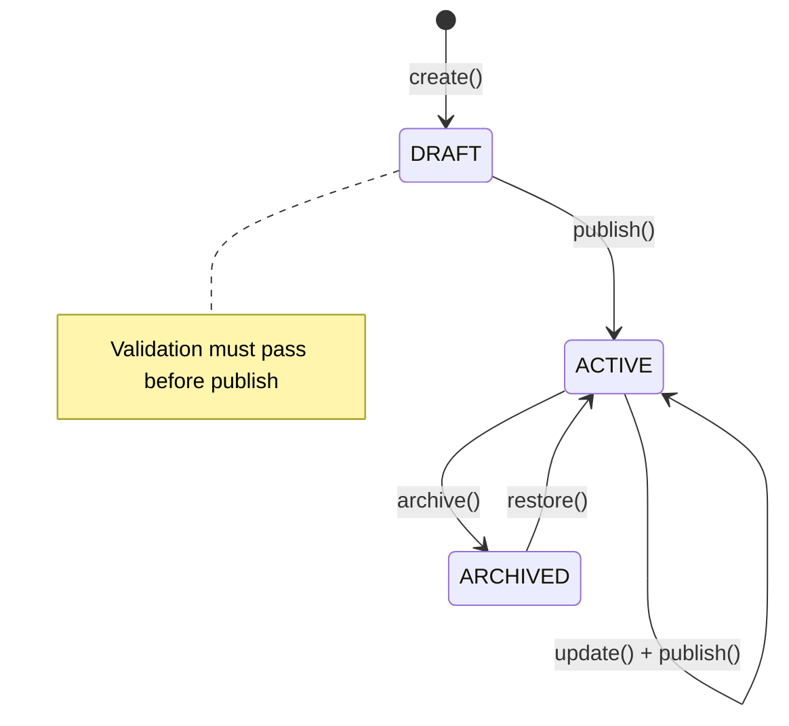
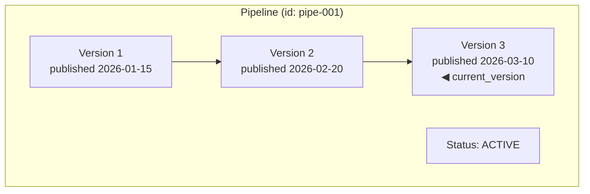
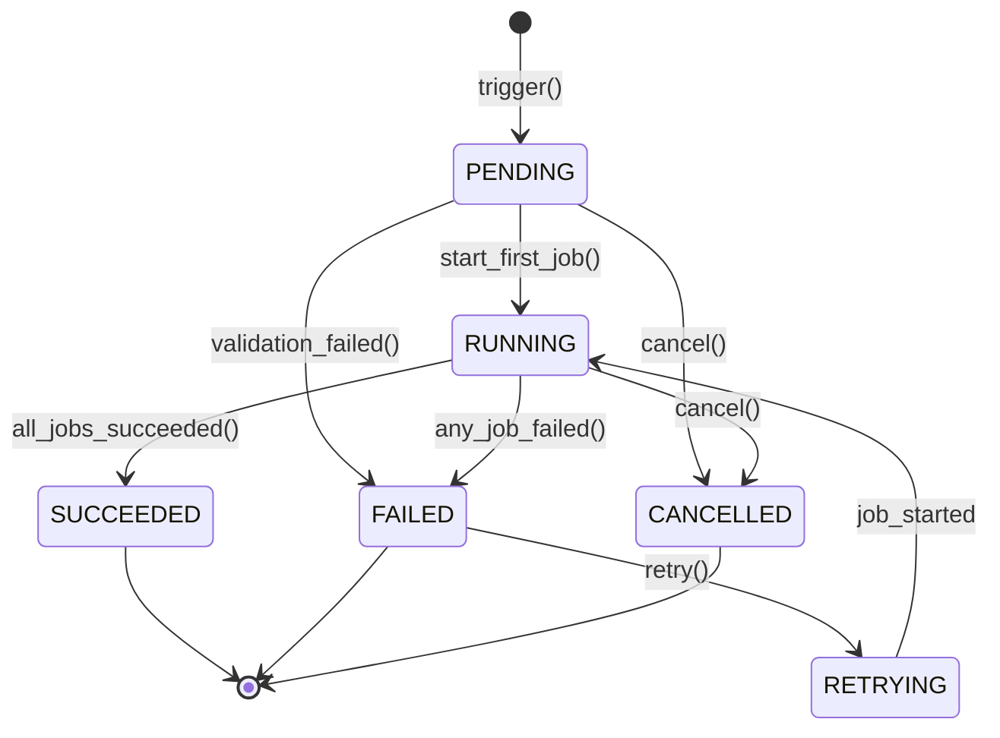
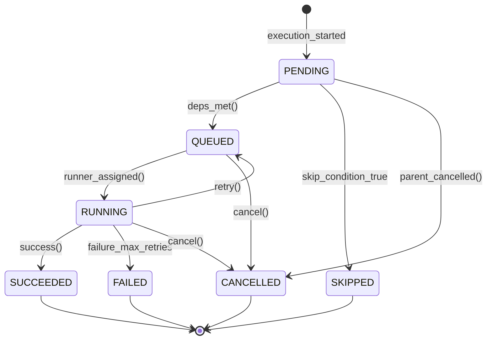
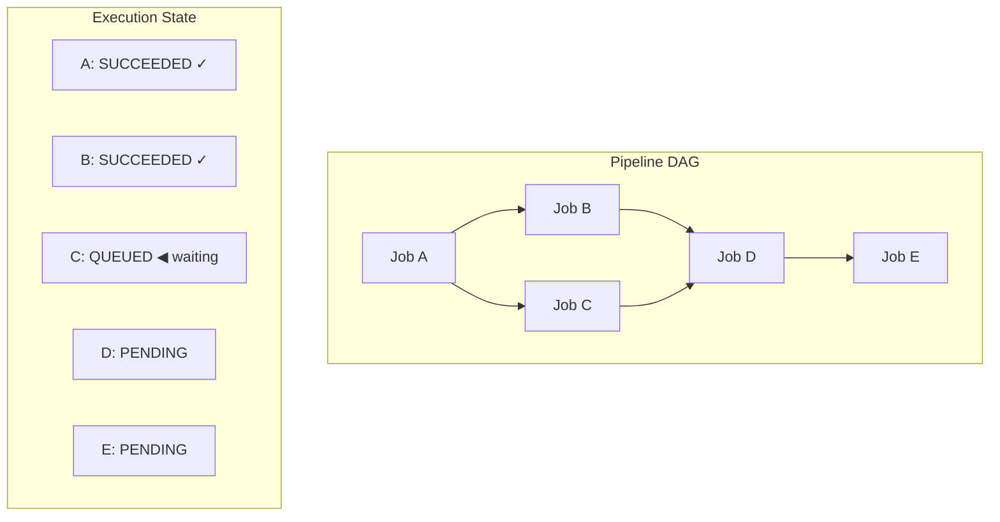
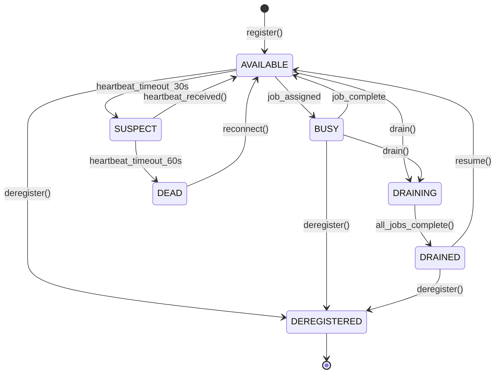
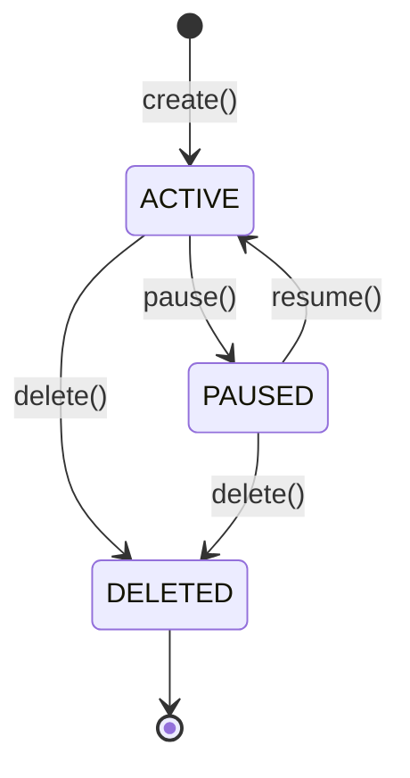
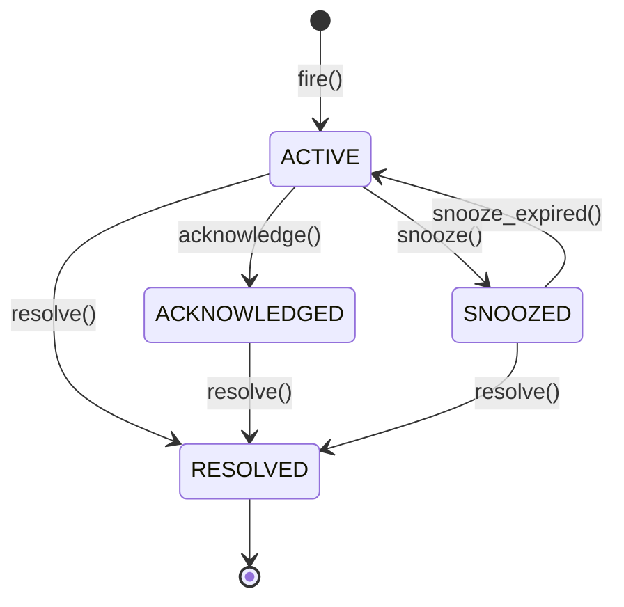

# State Machine Diagrams

This document defines all state machines in Pravah. State machines are critical for correctness — they define valid transitions and prevent illegal states.

---

## Overview

| Entity | States | Key Transitions |
|--------|--------|-----------------|
| [Pipeline](#1-pipeline-state-machine) | 4 | draft → active → archived |
| [Execution](#2-execution-state-machine) | 6 | pending → running → succeeded/failed |
| [Job](#3-job-state-machine) | 7 | pending → queued → running → succeeded/failed |
| [Runner](#4-runner-state-machine) | 6 | registered → available → busy → draining |
| [Schedule](#5-schedule-state-machine) | 3 | active ↔ paused |
| [Alert](#6-alert-state-machine) | 5 | active → acknowledged → resolved |

---

## 1. Pipeline State Machine

Pipelines have a simple lifecycle focused on version management.



### State Definitions

| State | Description | Allowed Actions |
|-------|-------------|-----------------|
| **DRAFT** | Initial state. Pipeline is being authored, not executable. | edit, validate, publish, delete |
| **ACTIVE** | Published and executable. Has at least one version. | edit, publish (new version), archive, trigger run |
| **ARCHIVED** | Soft-deleted. Not visible by default, not schedulable. | restore, hard delete |

### Transition Rules

```java
public enum PipelineState {
    DRAFT, ACTIVE, ARCHIVED;
    
    public boolean canTransitionTo(PipelineState target) {
        return switch (this) {
            case DRAFT    -> target == ACTIVE;  // publish
            case ACTIVE   -> target == ARCHIVED;  // archive
            case ARCHIVED -> target == ACTIVE;  // restore
        };
    }
}
```

### Version Management



**Version Rules:**
- Versions are immutable once published
- `current_version` points to latest published
- Executions reference a specific version
- Old versions kept for audit and rollback

---

## 2. Execution State Machine

Executions represent a single run of a pipeline. This is the most complex state machine.



**Terminal States:** SUCCEEDED, FAILED (unless retried), CANCELLED

### State Definitions

| State | Description | Entry Condition | Exit Condition |
|-------|-------------|-----------------|----------------|
| **PENDING** | Execution created, waiting to start | trigger() | First job starts OR cancelled OR validation fails |
| **RUNNING** | At least one job is executing | Any job transitions to RUNNING | All jobs complete OR cancelled |
| **SUCCEEDED** | All jobs completed successfully | All jobs in SUCCEEDED state | Terminal state |
| **FAILED** | At least one job failed | Any job in FAILED state (after retries exhausted) | retry() starts new attempt |
| **CANCELLED** | User cancelled the execution | cancel() called | Terminal state |
| **RETRYING** | Failed execution being retried from a checkpoint | retry() on FAILED execution | First retried job starts |

### Transition Table

| From | To | Trigger | Guard Condition |
|------|----|---------|-----------------|
| PENDING | RUNNING | job_started | First job in DAG |
| PENDING | FAILED | validation_failed | Invalid parameters, missing connection |
| PENDING | CANCELLED | cancel() | User action |
| RUNNING | SUCCEEDED | all_jobs_complete | All jobs SUCCEEDED |
| RUNNING | FAILED | job_failed | Job FAILED after retry exhaustion |
| RUNNING | CANCELLED | cancel() | User action |
| FAILED | RETRYING | retry() | User action, within retry window |
| RETRYING | RUNNING | job_started | First retried job |

### Code Implementation

```java
public class Execution {
    private ExecutionState state;
    
    public void start() {
        if (state != ExecutionState.PENDING) {
            throw new IllegalStateException("Cannot start execution in state: " + state);
        }
        state = ExecutionState.RUNNING;
        publishEvent(new ExecutionStartedEvent(this));
    }
    
    public void complete(boolean success) {
        if (state != ExecutionState.RUNNING) {
            throw new IllegalStateException("Cannot complete execution in state: " + state);
        }
        state = success ? ExecutionState.SUCCEEDED : ExecutionState.FAILED;
        publishEvent(new ExecutionCompletedEvent(this, success));
    }
    
    public void cancel() {
        if (state.isTerminal()) {
            throw new IllegalStateException("Cannot cancel terminal execution");
        }
        state = ExecutionState.CANCELLED;
        publishEvent(new ExecutionCancelledEvent(this));
    }
}
```

---

## 3. Job State Machine

Jobs are individual stage executions within an Execution.



**Retry Logic:** On failure, if `attempt < max`, job returns to QUEUED. Otherwise, moves to FAILED.

### State Definitions

| State | Description | Stored In |
|-------|-------------|-----------|
| **PENDING** | Job created, waiting for dependencies | execution_db.jobs |
| **QUEUED** | Dependencies met, waiting for runner | execution_db.jobs |
| **RUNNING** | Assigned to runner, executing | execution_db.jobs + Redis (real-time) |
| **SUCCEEDED** | Completed successfully | execution_db.jobs |
| **FAILED** | Failed after all retry attempts | execution_db.jobs |
| **CANCELLED** | Parent execution cancelled | execution_db.jobs |
| **SKIPPED** | Skip condition evaluated to true | execution_db.jobs |

### Dependency Resolution



**Resolution Logic:**
When C completes:
1. C → SUCCEEDED
2. Check D deps: [B: ✓, C: ✓] → D → QUEUED
3. E still waiting for D

### Retry Logic

```java
public class Job {
    private static final int MAX_ATTEMPTS = 3;
    private int attempt = 1;
    
    public void fail(String error) {
        if (attempt < MAX_ATTEMPTS) {
            // Retry
            attempt++;
            state = JobState.QUEUED;
            publishEvent(new JobRetryingEvent(this, attempt));
        } else {
            // Exhausted
            state = JobState.FAILED;
            publishEvent(new JobFailedEvent(this, error));
        }
    }
}
```

---

## 4. Runner State Machine

Runners are the execution agents that run jobs.



**Transitions:**
- AVAILABLE → BUSY: when at max capacity
- BUSY → AVAILABLE: when below capacity
- SUSPECT: missed 1-2 heartbeats (30s)
- DEAD: missed 3+ heartbeats (60s)

### State Definitions

| State | Description | Can Accept Jobs? |
|-------|-------------|------------------|
| **AVAILABLE** | Healthy, has capacity | ✅ Yes |
| **BUSY** | At max capacity | ❌ No |
| **DRAINING** | Admin requested drain, finishing current work | ❌ No |
| **DRAINED** | Drain complete, no active jobs | ❌ No |
| **SUSPECT** | Missed 1-2 heartbeats (30-60s silence) | ❌ No |
| **DEAD** | Missed 3+ heartbeats (>60s silence) | ❌ No |
| **DEREGISTERED** | Explicitly removed | ❌ No |

### Health Monitoring Timeline

```mermaid
gantt
    title Runner Health Monitoring
    dateFormat X
    axisFormat %s
    
    section Heartbeats
    HB1 :milestone, 0, 0
    HB2 :milestone, 10, 10
    HB3 :milestone, 20, 20
    
    section State
    AVAILABLE :active, 0, 30
    SUSPECT :crit, 30, 60
    DEAD :done, 60, 70
```



**Timeline:**
- Runner sends heartbeat every 10 seconds
- SUSPECT after 30s silence
- DEAD after 60s silence

### Capacity Management

```java
public class Runner {
    private final int maxCapacity;  // e.g., 4 concurrent jobs
    private final AtomicInteger activeJobs = new AtomicInteger(0);
    
    public boolean hasCapacity() {
        return state == RunnerState.AVAILABLE 
            && activeJobs.get() < maxCapacity;
    }
    
    public void assignJob(Job job) {
        int current = activeJobs.incrementAndGet();
        if (current >= maxCapacity) {
            state = RunnerState.BUSY;
        }
    }
    
    public void completeJob(Job job) {
        int current = activeJobs.decrementAndGet();
        if (state == RunnerState.BUSY && current < maxCapacity) {
            state = RunnerState.AVAILABLE;
        }
        if (state == RunnerState.DRAINING && current == 0) {
            state = RunnerState.DRAINED;
        }
    }
}
```

---

## 5. Schedule State Machine

Schedules are simple: active or paused.



### Schedule Evaluation

```java
@Scheduled(fixedRate = 60_000)  // Every minute
public void evaluateSchedules() {
    if (!leaderElection.isLeader()) return;
    
    Instant now = Instant.now();
    List<Schedule> dueSchedules = scheduleRepository
        .findDueSchedules(now, ScheduleState.ACTIVE);
    
    for (Schedule schedule : dueSchedules) {
        triggerExecution(schedule);
        schedule.setLastRunAt(now);
        schedule.setNextRunAt(schedule.computeNextRun(now));
        scheduleRepository.save(schedule);
    }
}
```

---

## 6. Alert State Machine

Alerts track lifecycle from firing to resolution.



**Auto-resolve:** Alerts can also be automatically resolved when the triggering condition clears.

### Alert Lifecycle

| State | Description | Notifications |
|-------|-------------|---------------|
| **ACTIVE** | Alert just fired | Send to all channels |
| **ACKNOWLEDGED** | User acknowledged, working on it | Stop escalation |
| **SNOOZED** | Temporarily silenced | No notifications until snooze expires |
| **RESOLVED** | Issue fixed | Send resolution notification |

---

## State Machine Implementation Pattern

### Using Spring State Machine (Optional)

```java
@Configuration
@EnableStateMachineFactory
public class ExecutionStateMachineConfig 
        extends StateMachineConfigurerAdapter<ExecutionState, ExecutionEvent> {
    
    @Override
    public void configure(StateMachineStateConfigurer<ExecutionState, ExecutionEvent> states)
            throws Exception {
        states
            .withStates()
            .initial(ExecutionState.PENDING)
            .state(ExecutionState.RUNNING)
            .end(ExecutionState.SUCCEEDED)
            .end(ExecutionState.FAILED)
            .end(ExecutionState.CANCELLED);
    }
    
    @Override
    public void configure(StateMachineTransitionConfigurer<ExecutionState, ExecutionEvent> transitions)
            throws Exception {
        transitions
            .withExternal()
                .source(PENDING).target(RUNNING).event(START)
            .and()
            .withExternal()
                .source(RUNNING).target(SUCCEEDED).event(COMPLETE)
                .guard(allJobsSucceeded())
            .and()
            .withExternal()
                .source(RUNNING).target(FAILED).event(FAIL);
    }
}
```

### Simple Enum-Based Approach (Recommended for Pravah)

```java
public enum ExecutionState {
    PENDING {
        @Override
        public ExecutionState onStart() { return RUNNING; }
        @Override
        public ExecutionState onCancel() { return CANCELLED; }
    },
    RUNNING {
        @Override
        public ExecutionState onComplete(boolean success) {
            return success ? SUCCEEDED : FAILED;
        }
        @Override
        public ExecutionState onCancel() { return CANCELLED; }
    },
    SUCCEEDED,
    FAILED {
        @Override
        public ExecutionState onRetry() { return RETRYING; }
    },
    CANCELLED,
    RETRYING {
        @Override
        public ExecutionState onStart() { return RUNNING; }
    };
    
    public ExecutionState onStart() { throw illegalTransition("start"); }
    public ExecutionState onComplete(boolean success) { throw illegalTransition("complete"); }
    public ExecutionState onCancel() { throw illegalTransition("cancel"); }
    public ExecutionState onRetry() { throw illegalTransition("retry"); }
    
    public boolean isTerminal() {
        return this == SUCCEEDED || this == FAILED || this == CANCELLED;
    }
    
    private IllegalStateException illegalTransition(String event) {
        return new IllegalStateException("Cannot " + event + " in state " + this);
    }
}
```

---

## Interview Questions

**Q: "What are the terminal states for an execution?"**
> SUCCEEDED, FAILED, and CANCELLED. Once in a terminal state, the execution cannot transition further. FAILED can become RETRYING if the user explicitly retries.

**Q: "What happens if a runner goes DEAD with active jobs?"**
> Jobs assigned to a DEAD runner are marked FAILED after a timeout (no completion message received). The Execution Service detects the runner heartbeat timeout, queries for jobs assigned to that runner, and transitions them to FAILED. If retry is enabled, they're re-queued.

**Q: "How do you prevent race conditions in state transitions?"**
> Optimistic locking with version numbers. Each state transition increments the version. If two processes try to transition simultaneously, one will fail with OptimisticLockException and retry.

**Q: "How do you handle the 'exactly-once' problem for job execution?"**
> Jobs have idempotency keys. Runners check before executing. If a runner crashes mid-execution and another runner picks up the job, the idempotency key prevents duplicate side effects. This requires stages to be designed for idempotency (e.g., INSERT with ON CONFLICT).

---

## Document History

| Version | Date | Author | Changes |
|---------|------|--------|---------|
| 1.0 | 2026-05-13 | Engineering | Initial state machines |
| 1.1 | 2026-05-13 | Engineering | Updated to Mermaid diagrams |
