# Sequence Diagrams

This document contains detailed sequence diagrams for key flows in Pravah. These are essential for understanding how services interact and for interview discussions.

---

## Overview of Key Flows

| Flow | Services Involved | Complexity |
|------|-------------------|------------|
| [1. Create Pipeline](#1-create-pipeline) | Gateway, Pipeline Service, Kafka | Simple |
| [2. Trigger Execution](#2-trigger-execution) | Gateway, Pipeline, Execution, Kafka | Medium |
| [3. Execute Job](#3-execute-job) | Execution, Runner Service, Runner | Complex |
| [4. Complete Execution](#4-complete-execution) | Runner, Execution, Notification, Agent | Complex |
| [5. Scheduled Trigger](#5-scheduled-trigger) | Scheduler, Execution, Kafka | Medium |
| [6. User Authentication](#6-user-authentication) | Gateway, Tenant Service, Vault | Medium |
| [7. Lineage Capture](#7-lineage-capture) | Runner, Metadata Service | Medium |
| [8. AI Diagnosis](#8-ai-diagnosis-on-failure) | Agent Service, LLM, Notification | Complex |

---

## 1. Create Pipeline

User creates a new pipeline through the UI.

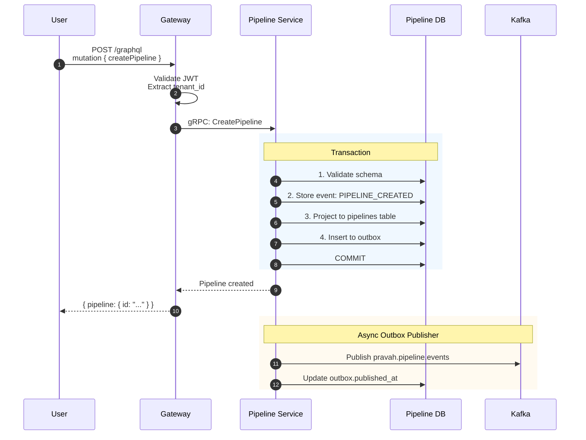

### Key Points for Interviews

1. **Event Sourcing**: `PIPELINE_CREATED` event stored first, then projected to read model
2. **Transactional Outbox**: Event + outbox in same transaction → guaranteed delivery to Kafka
3. **Async Publishing**: User gets response immediately; Kafka publish happens async

---

## 2. Trigger Execution

User manually triggers a pipeline run.

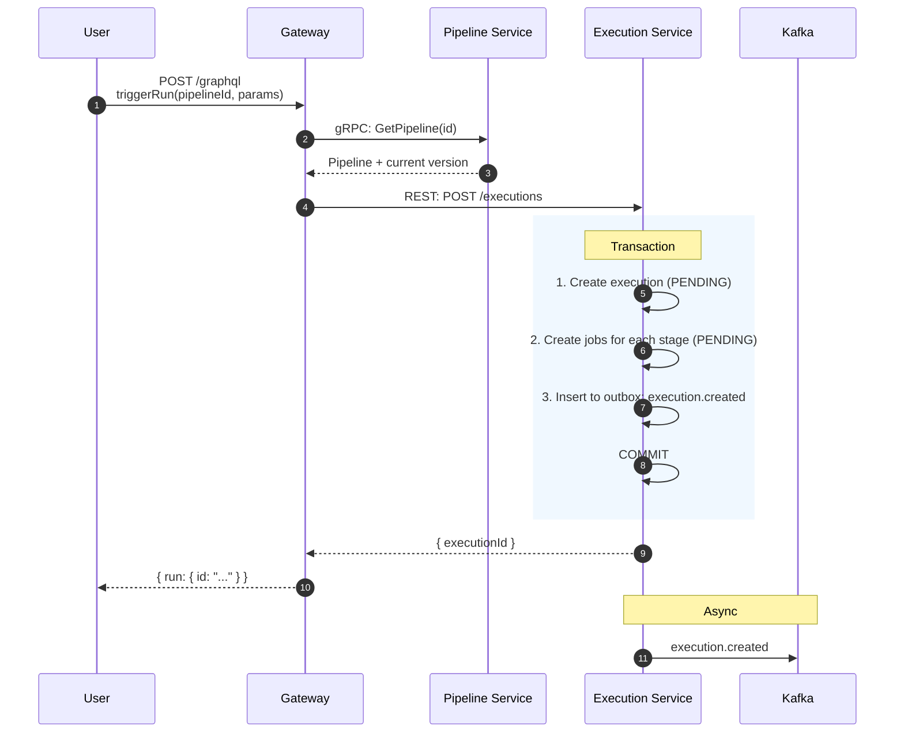

**Continuation - Execution Service processes its own event:**

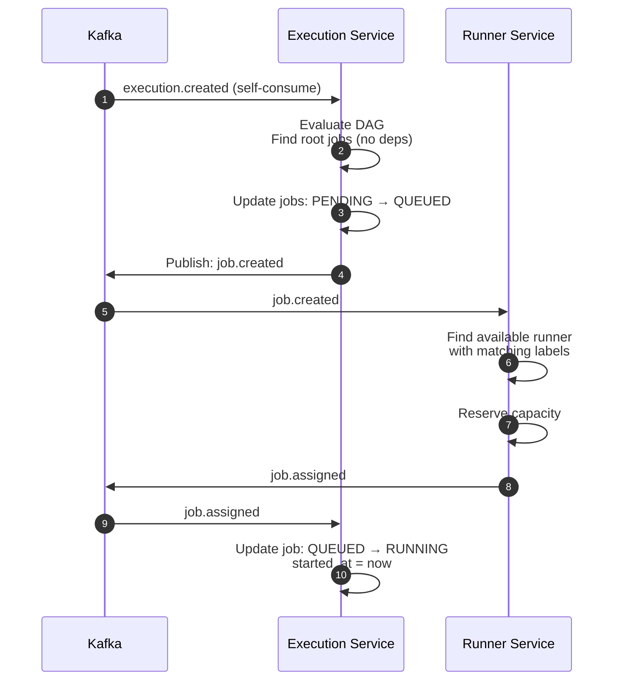

---

## 3. Execute Job

Runner executes a job and reports back.

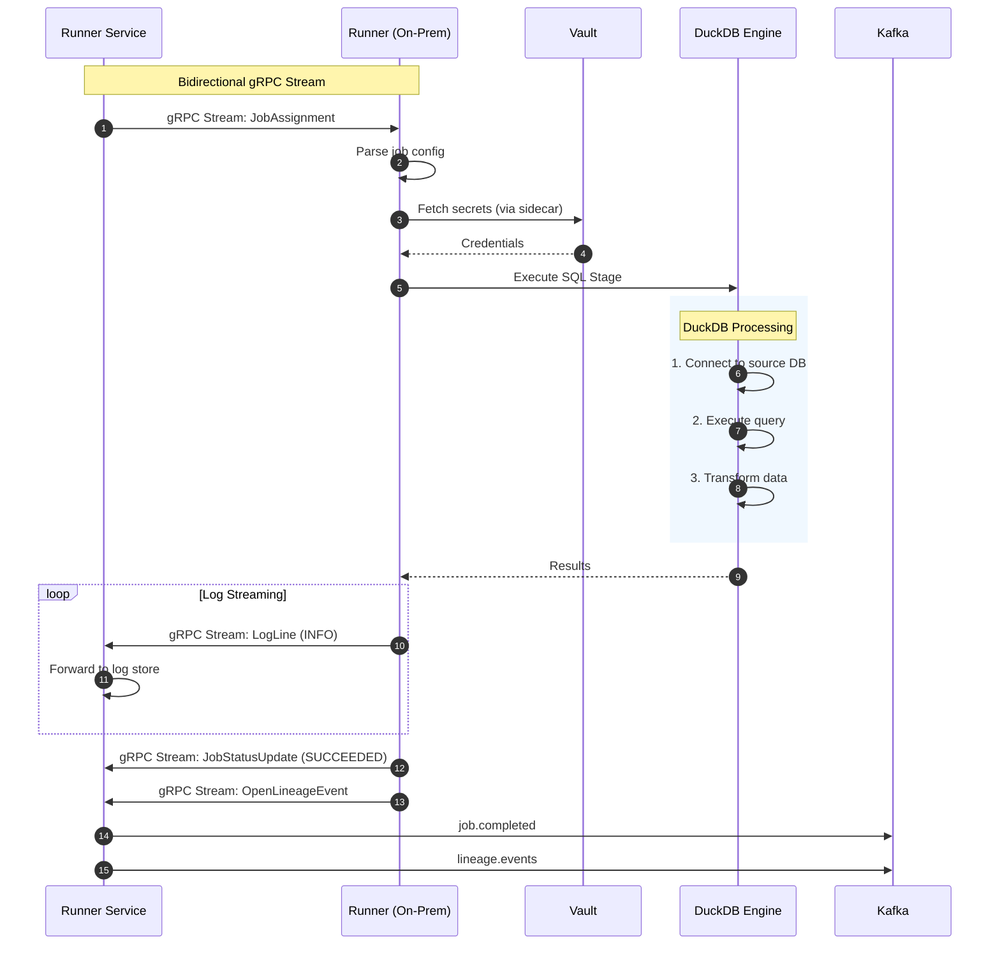

---

## 4. Complete Execution

Full flow when an execution completes (success or failure).

### Success Path

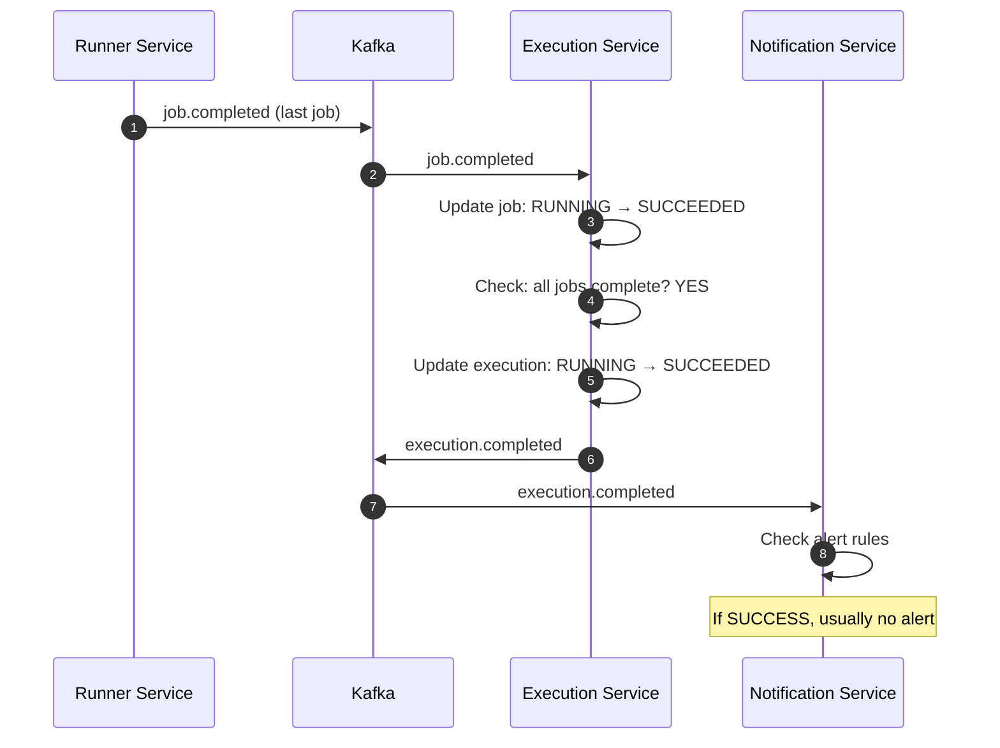

### Failure Path

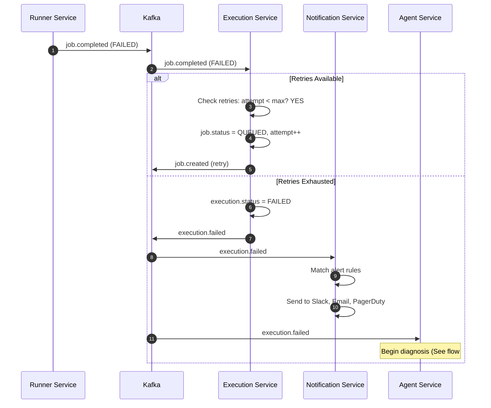

---

## 5. Scheduled Trigger

Scheduler evaluates cron schedules and triggers executions.

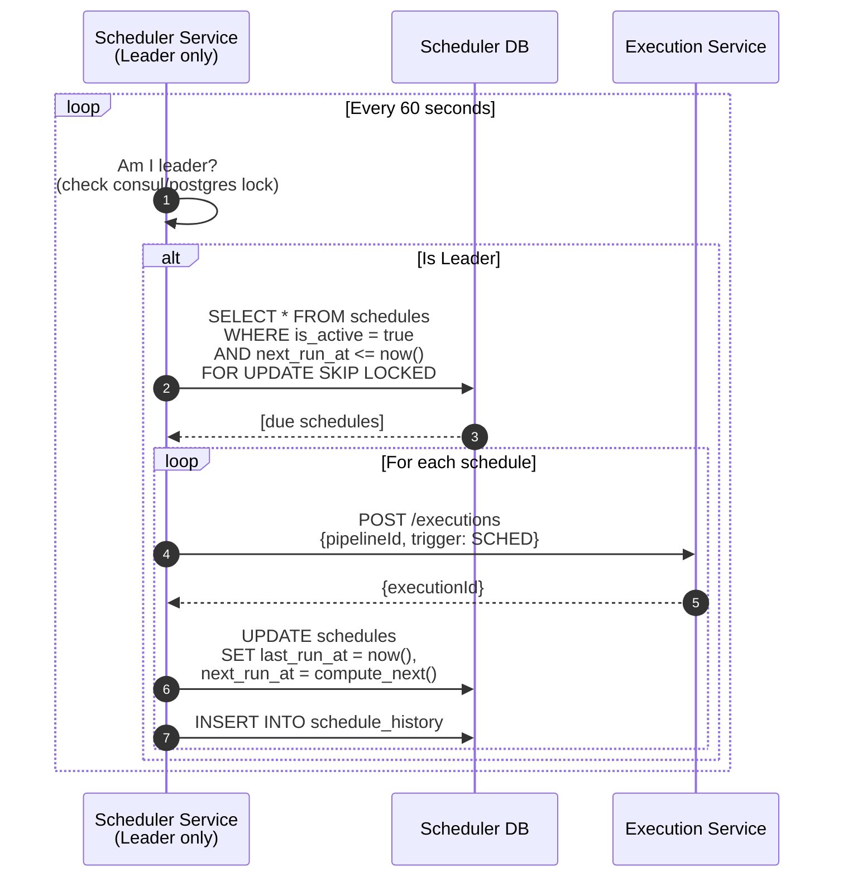

### Catchup Behavior

When scheduler was down and needs to catch up:

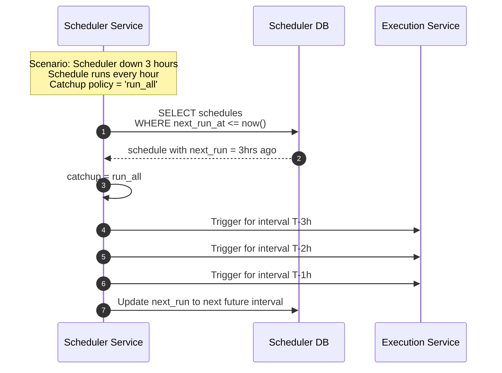

---

## 6. User Authentication

User logs in and accesses the API.

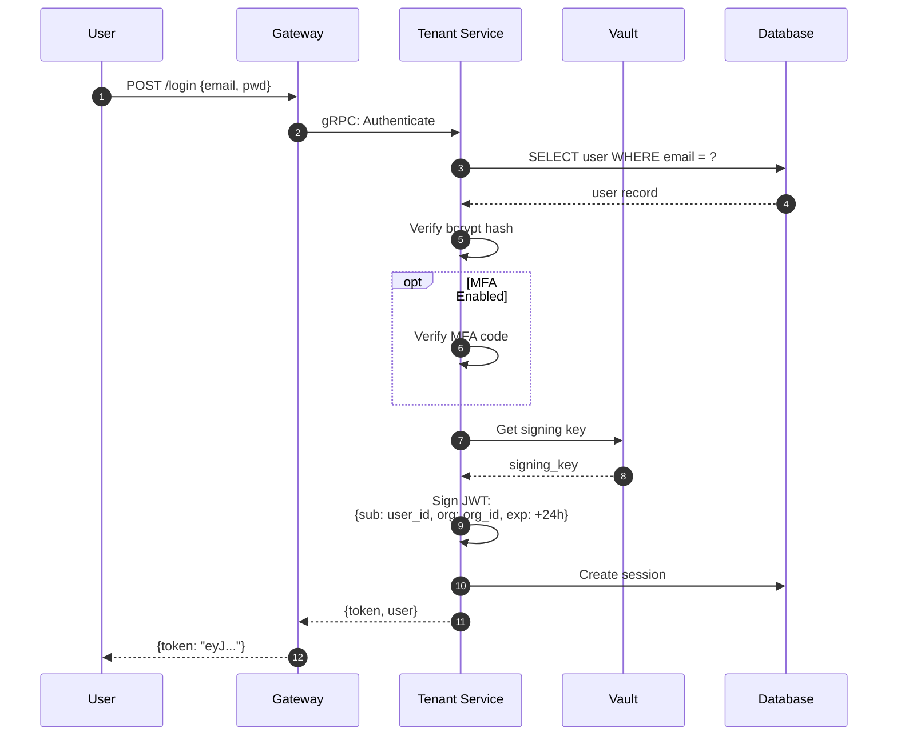

### Subsequent API Call

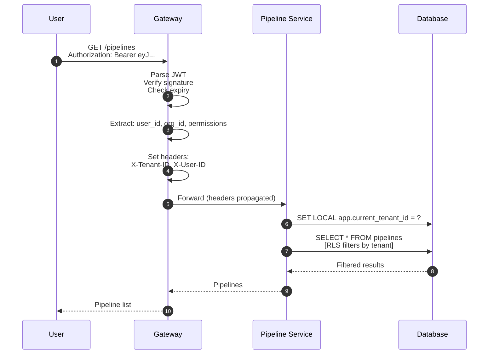

---

## 7. Lineage Capture

How lineage is captured during job execution.

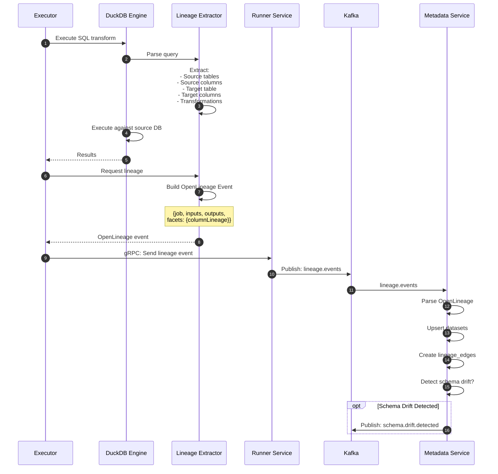

---

## 8. AI Diagnosis on Failure

Agent Service diagnoses a failed execution using ReAct pattern.

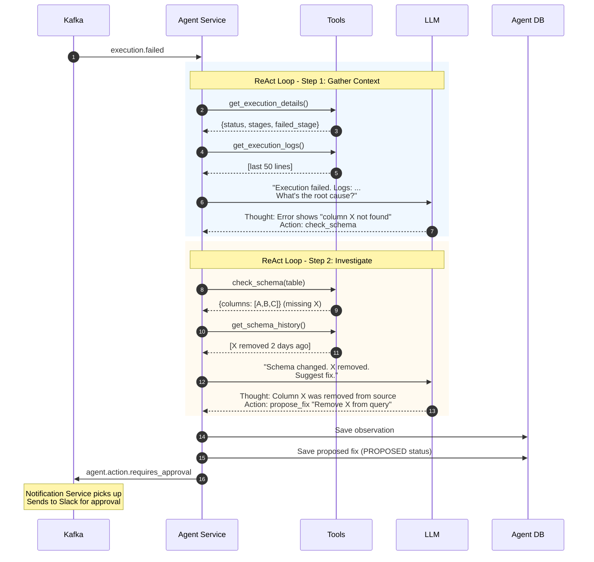

---

## Interview Tips

**Q: "Walk me through what happens when a user runs a pipeline."**
> Start with diagram #2. Emphasize:
> 1. Request goes through Gateway (auth, routing)
> 2. Pipeline Service returns definition
> 3. Execution Service creates execution + jobs atomically
> 4. Outbox ensures Kafka publish
> 5. Events flow through saga pattern
> 6. Runner receives job via gRPC stream

**Q: "How do you handle failures?"**
> Reference diagram #4. Key points:
> 1. Retries at job level (configurable, exponential backoff)
> 2. After retry exhaustion, execution marked FAILED
> 3. Failure event triggers notification + AI diagnosis
> 4. AI agent uses tools to investigate and propose fixes

**Q: "Explain your event-driven architecture."**
> All diagrams show Kafka as the backbone. Key patterns:
> 1. Outbox ensures consistency
> 2. Saga choreography for distributed transactions
> 3. Idempotent consumers with event ID tracking
> 4. Dead letter topics for poison messages

**Q: "How do you ensure exactly-once processing?"**
> Combination of:
> 1. Transactional outbox (DB + event atomic)
> 2. Idempotent consumers (check processed_events table)
> 3. Idempotent stage execution (idempotency keys)

---

## Document History

| Version | Date | Author | Changes |
|---------|------|--------|---------|
| 1.0 | 2026-05-13 | Engineering | Initial sequence diagrams |
| 1.1 | 2026-05-13 | Engineering | Updated to Mermaid diagrams |
