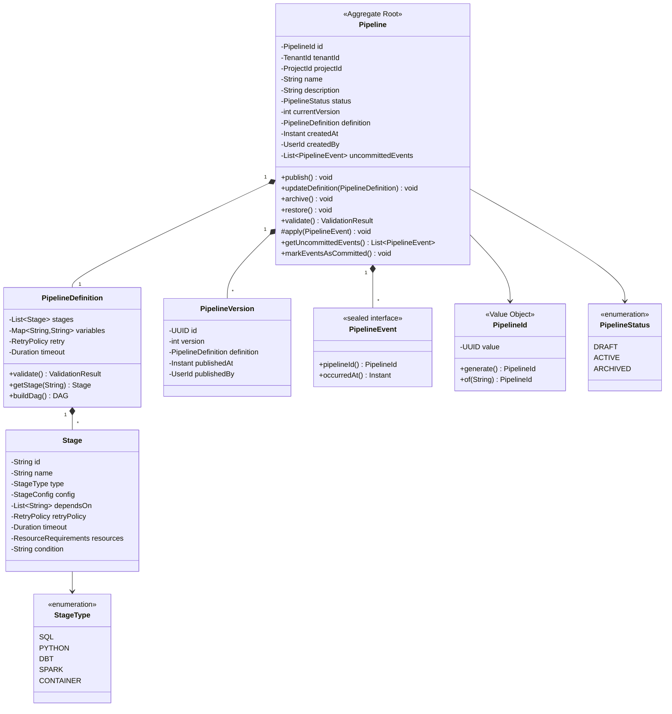
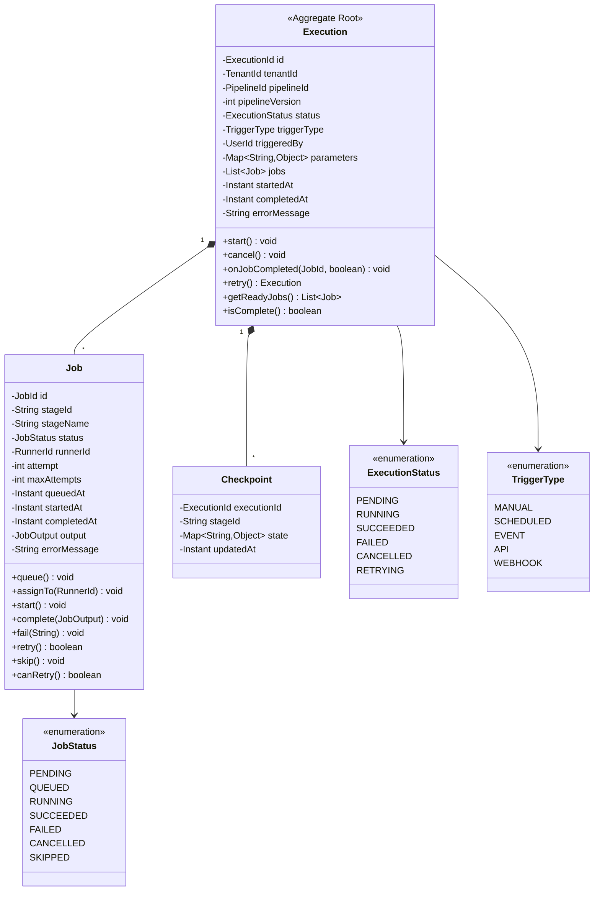
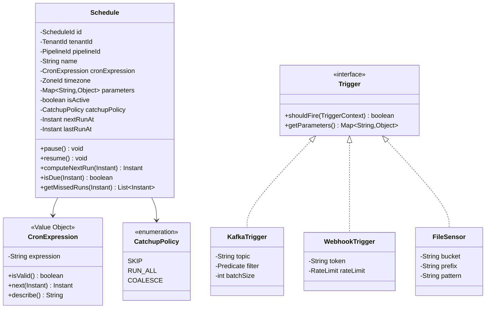
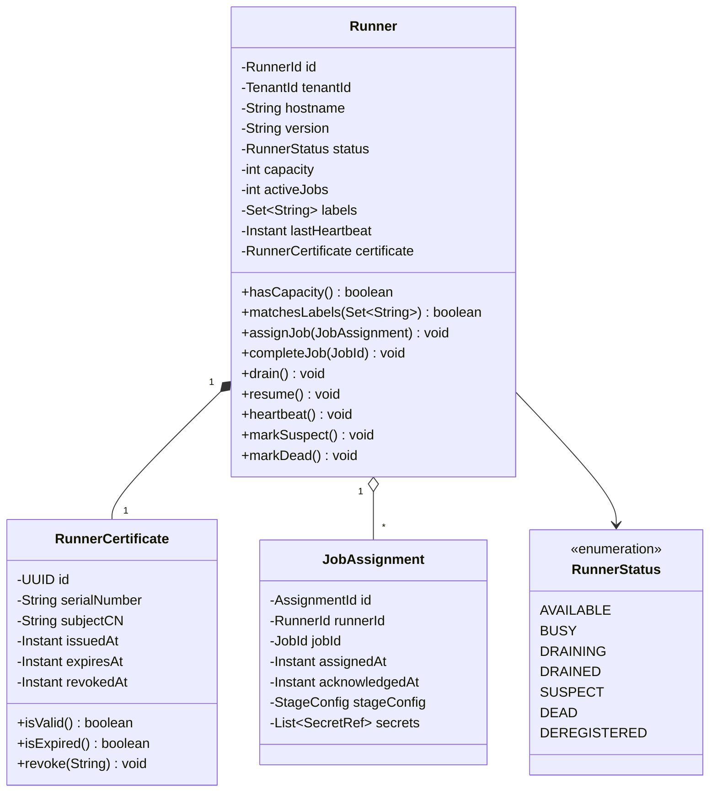
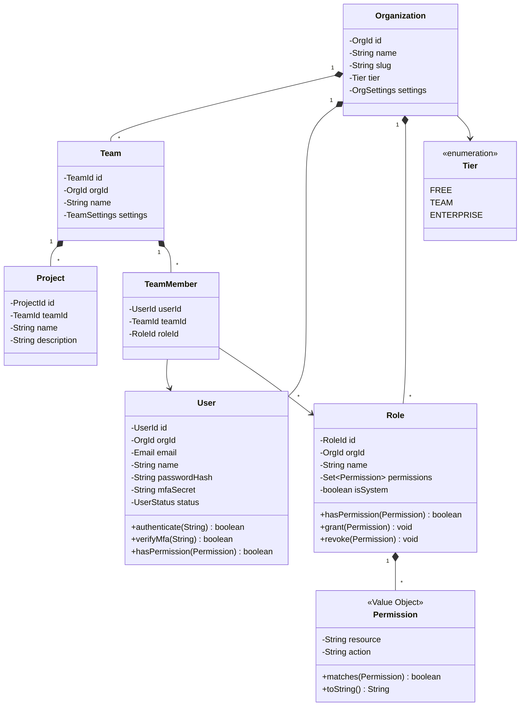
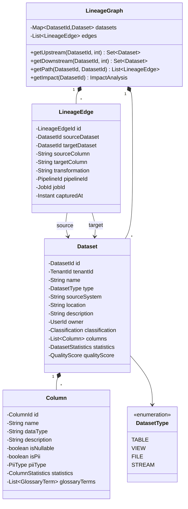
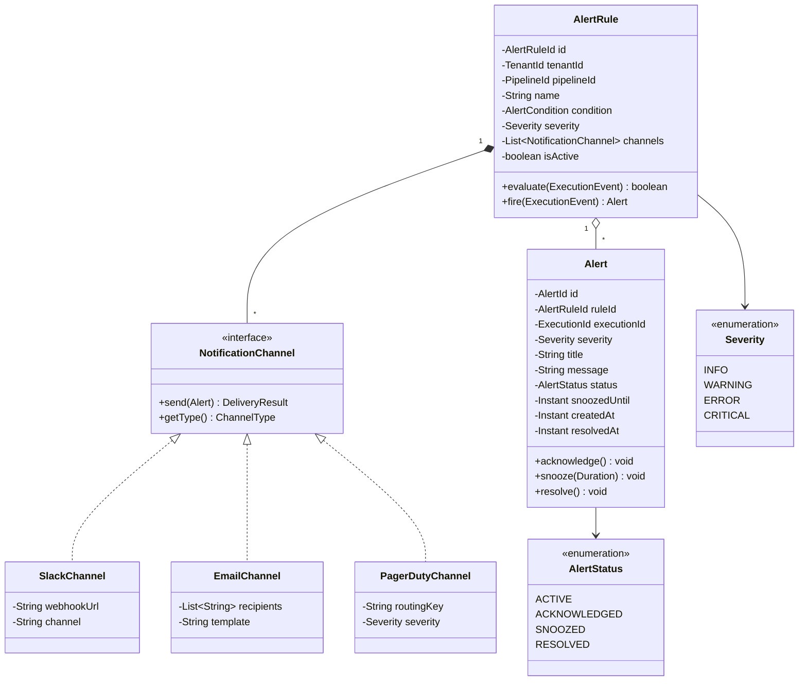
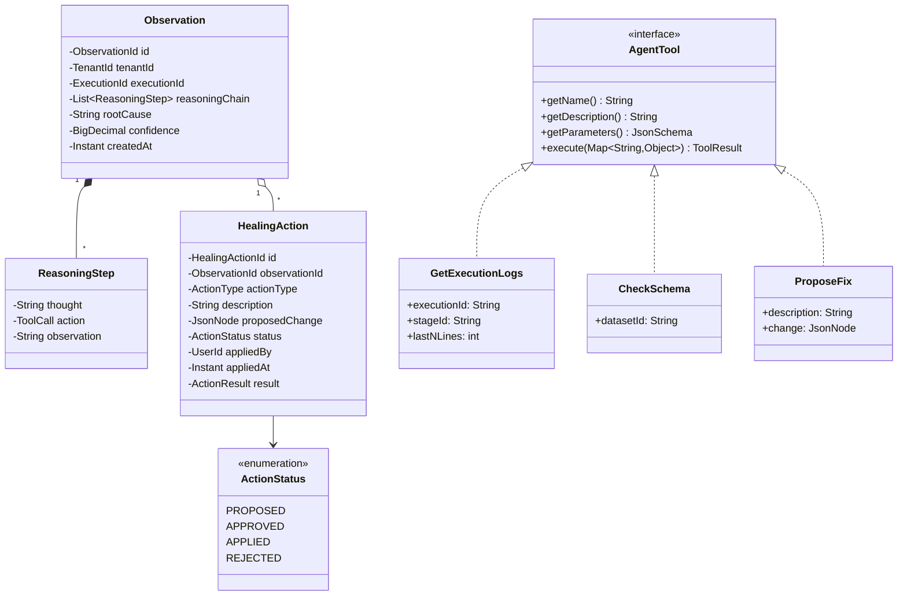

# Class Diagrams & Domain Models

This document contains class diagrams for each service's domain model. These show the core entities, their relationships, and key methods.

---

## Overview

| Service | Key Entities | Pattern |
|---------|--------------|---------|
| [Pipeline Service](#1-pipeline-service) | Pipeline, Stage, Version, Event | Event Sourcing, Aggregate |
| [Execution Service](#2-execution-service) | Execution, Job, Checkpoint | State Machine |
| [Scheduler Service](#3-scheduler-service) | Schedule, Trigger, EventTrigger | Strategy |
| [Runner Service](#4-runner-service) | Runner, Assignment, Certificate | State Machine |
| [Tenant Service](#5-tenant-service) | Org, Team, User, Role | Hierarchical |
| [Metadata Service](#6-metadata-service) | Dataset, Column, LineageEdge | Graph |
| [Notification Service](#7-notification-service) | AlertRule, Alert, Channel | Observer |
| [Agent Service](#8-agent-service) | Observation, HealingAction | ReAct Agent |

---

## 1. Pipeline Service

### Domain Model



### Java Implementation

```java
// Aggregate Root with Event Sourcing
public class Pipeline {
    private final PipelineId id;
    private TenantId tenantId; // Initialized in apply for Created event
    private String name;
    private PipelineStatus status;
    private int currentVersion;
    private PipelineDefinition definition;
    
    private final List<PipelineEvent> uncommittedEvents = new ArrayList<>();
    
    // Factory method for creation
    public static Pipeline create(TenantId tenantId, ProjectId projectId, 
                                   String name, UserId createdBy) {
        Pipeline pipeline = new Pipeline(PipelineId.generate(), tenantId);
        pipeline.apply(new PipelineEvent.Created(
            pipeline.id, tenantId, projectId, name, createdBy, Instant.now()
        ));
        return pipeline;
    }
    
    // Reconstitute from events
    public static Pipeline fromEvents(PipelineId id, List<PipelineEvent> events) {
        Pipeline pipeline = new Pipeline(id, null);
        events.forEach(pipeline::apply);
        pipeline.uncommittedEvents.clear(); // These are already persisted
        return pipeline;
    }
    
    public void publish() {
        if (status != PipelineStatus.DRAFT && status != PipelineStatus.ACTIVE) {
            throw new IllegalStateException("Cannot publish in state: " + status);
        }
        ValidationResult result = definition.validate();
        if (!result.isValid()) {
            throw new ValidationException(result.getErrors());
        }
        apply(new PipelineEvent.Published(id, currentVersion + 1, Instant.now()));
    }
    
    private void apply(PipelineEvent event) {
        // Apply state change
        switch (event) {
            case PipelineEvent.Created e -> {
                this.tenantId = e.tenantId();
                this.name = e.name();
                this.status = PipelineStatus.DRAFT;
                this.currentVersion = 0;
            }
            case PipelineEvent.Published e -> {
                this.status = PipelineStatus.ACTIVE;
                this.currentVersion = e.version();
            }
            case PipelineEvent.Archived e -> this.status = PipelineStatus.ARCHIVED;
            // ... other events
        }
        uncommittedEvents.add(event);
    }
}

// Sealed interface for events
public sealed interface PipelineEvent {
    PipelineId pipelineId();
    Instant occurredAt();
    
    record Created(PipelineId pipelineId, TenantId tenantId, ProjectId projectId,
                   String name, UserId createdBy, Instant occurredAt) 
        implements PipelineEvent {}
    
    record Updated(PipelineId pipelineId, PipelineDefinition definition, 
                   UserId updatedBy, Instant occurredAt) 
        implements PipelineEvent {}
    
    record Published(PipelineId pipelineId, int version, Instant occurredAt) 
        implements PipelineEvent {}
    
    record Archived(PipelineId pipelineId, UserId archivedBy, Instant occurredAt) 
        implements PipelineEvent {}
}

// Value Object
public record PipelineId(UUID value) {
    public static PipelineId generate() {
        return new PipelineId(UUID.randomUUID());
    }
    
    public static PipelineId of(String value) {
        return new PipelineId(UUID.fromString(value));
    }
}
```

---

## 2. Execution Service

### Domain Model



### Java Implementation

```java
public class Execution {
    private final ExecutionId id;
    private ExecutionStatus status = ExecutionStatus.PENDING;
    private final List<Job> jobs = new ArrayList<>();
    
    public void start() {
        if (status != ExecutionStatus.PENDING) {
            throw new IllegalStateException("Cannot start execution in state: " + status);
        }
        status = ExecutionStatus.RUNNING;
        startedAt = Instant.now();
        
        // Queue jobs with no dependencies
        getReadyJobs().forEach(Job::queue);
    }
    
    public List<Job> getReadyJobs() {
        return jobs.stream()
            .filter(job -> job.getStatus() == JobStatus.PENDING)
            .filter(this::allDependenciesSatisfied)
            .toList();
    }
    
    private boolean allDependenciesSatisfied(Job job) {
        return job.getDependencies().stream()
            .allMatch(depStageId -> jobs.stream()
                .filter(j -> j.getStageId().equals(depStageId))
                .allMatch(j -> j.getStatus() == JobStatus.SUCCEEDED));
    }
    
    public void onJobCompleted(JobId jobId, boolean success) {
        Job job = findJob(jobId);
        
        if (!success && job.canRetry()) {
            job.retry();
            return;
        }
        
        if (!success) {
            status = ExecutionStatus.FAILED;
            completedAt = Instant.now();
            return;
        }
        
        // Check if all jobs complete
        if (jobs.stream().allMatch(j -> j.getStatus() == JobStatus.SUCCEEDED)) {
            status = ExecutionStatus.SUCCEEDED;
            completedAt = Instant.now();
        } else {
            // Queue newly ready jobs
            getReadyJobs().forEach(Job::queue);
        }
    }
}

public class Job {
    private JobStatus status = JobStatus.PENDING;
    private int attempt = 1;
    private final int maxAttempts;
    
    public boolean canRetry() {
        return attempt < maxAttempts;
    }
    
    public void retry() {
        if (!canRetry()) {
            throw new IllegalStateException("Max retry attempts reached");
        }
        attempt++;
        status = JobStatus.QUEUED;
        queuedAt = Instant.now();
    }
    
    public void fail(String error) {
        status = JobStatus.FAILED;
        errorMessage = error;
        completedAt = Instant.now();
    }
}
```

---

## 3. Scheduler Service

### Domain Model



---

## 4. Runner Service

### Domain Model



---

## 5. Tenant Service

### Domain Model



---

## 6. Metadata Service

### Domain Model



---

## 7. Notification Service

### Domain Model



---

## 8. Agent Service

### Domain Model



---

## Common Patterns Across Services

### Repository Pattern

```java
public interface PipelineRepository {
    Optional<Pipeline> findById(PipelineId id);
    Pipeline save(Pipeline pipeline);
    void delete(PipelineId id);
    List<Pipeline> findByProjectId(ProjectId projectId, Pageable pageable);
    List<Pipeline> findByTenantId(TenantId tenantId, Pageable pageable);
}
```

### Domain Service Pattern

```java
@Service
public class ExecutionDomainService {
    private final ExecutionRepository executionRepository;
    private final PipelineRepository pipelineRepository;
    private final EventPublisher eventPublisher;
    
    public Execution triggerExecution(PipelineId pipelineId, 
                                       Map<String, Object> params,
                                       TriggerType triggerType,
                                       UserId triggeredBy) {
        Pipeline pipeline = pipelineRepository.findById(pipelineId)
            .orElseThrow(() -> new PipelineNotFoundException(pipelineId));
        
        Execution execution = Execution.create(
            pipeline, params, triggerType, triggeredBy
        );
        
        execution = executionRepository.save(execution);
        eventPublisher.publish(new ExecutionCreatedEvent(execution));
        
        return execution;
    }
}
```

---

## Interview Questions

**Q: "Why use Value Objects for IDs?"**
> Type safety. `PipelineId` is not accidentally assignable to `ExecutionId`. Method signatures are self-documenting. Parsing and validation happen once at construction.

**Q: "Explain the Aggregate Root pattern."**
> Pipeline is an aggregate root. All modifications to stages, variables, etc. go through Pipeline. This ensures invariants are maintained. We never persist a Stage directly — we persist the Pipeline which contains stages.

**Q: "How do you handle concurrency?"**
> Optimistic locking with version numbers. The repository checks the version on update. If another transaction modified the entity, we get an `OptimisticLockException` and retry.

**Q: "Why sealed interfaces for events?"**
> Compile-time exhaustiveness checking. When pattern matching on `PipelineEvent`, the compiler ensures we handle all cases. Adding a new event type forces us to update all handlers.

---

## Document History

| Version | Date | Author | Changes |
|---------|------|--------|---------|
| 1.0 | 2026-05-13 | Engineering | Initial class diagrams |
| 1.1 | 2026-05-13 | Engineering | Updated to Mermaid diagrams |
