# Scalability & Failure Analysis

This document analyzes how Pravah scales and handles failures. Essential for system design interviews and operational planning.

---

## Table of Contents

1. [Scalability Analysis](#scalability-analysis)
2. [Bottleneck Analysis](#bottleneck-analysis)
3. [Failure Modes](#failure-modes)
4. [Disaster Recovery](#disaster-recovery)
5. [Capacity Planning](#capacity-planning)
6. [Interview Questions](#interview-questions)

---

## Scalability Analysis

### Scale Dimensions

| Dimension | Current Target | Scale Factor | Limiting Factor |
|-----------|----------------|--------------|-----------------|
| Concurrent executions | 10,000 | Kafka partitions, Runner fleet | Runner capacity |
| Pipelines per tenant | 10,000 | PostgreSQL | Query performance |
| Tenants | 1,000 | Database connections | Connection pooling |
| Events/second | 100,000 | Kafka throughput | Broker capacity |
| Log lines/second | 1,000,000 | Log aggregation | Elasticsearch |

### Horizontal Scaling Model

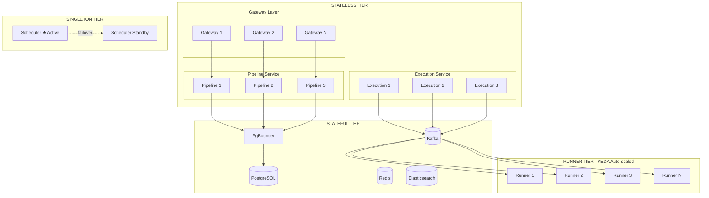

### Service-Specific Scaling

#### Pipeline Service

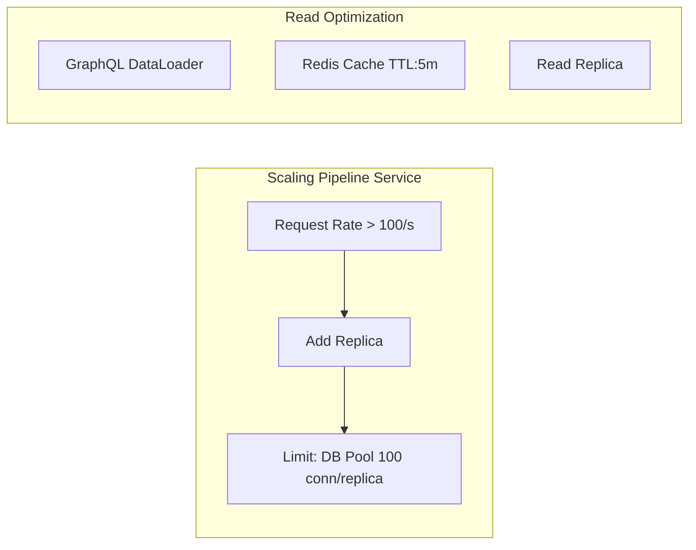

**Scaling trigger:** API request rate  
**Metric:** requests/second > 100 per replica  
**Action:** Add replica  
**Limit:** Database connection pool (100 connections per replica)

#### Execution Service

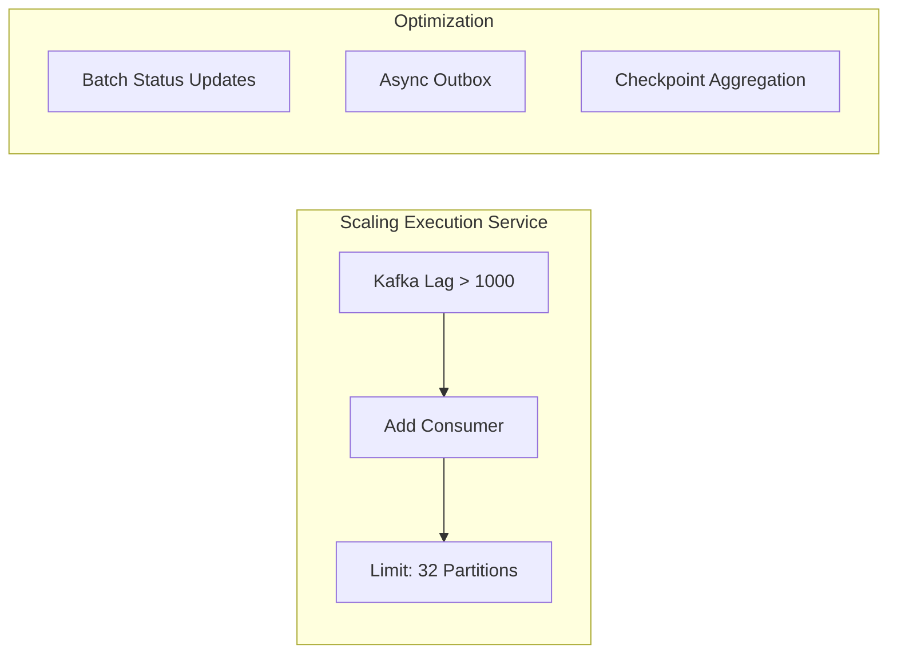

**Scaling trigger:** Kafka consumer lag  
**Metric:** lag > 1000 messages  
**Action:** Add consumer replica  
**Limit:** Kafka partitions (32 default)

#### Runner Service (KEDA)

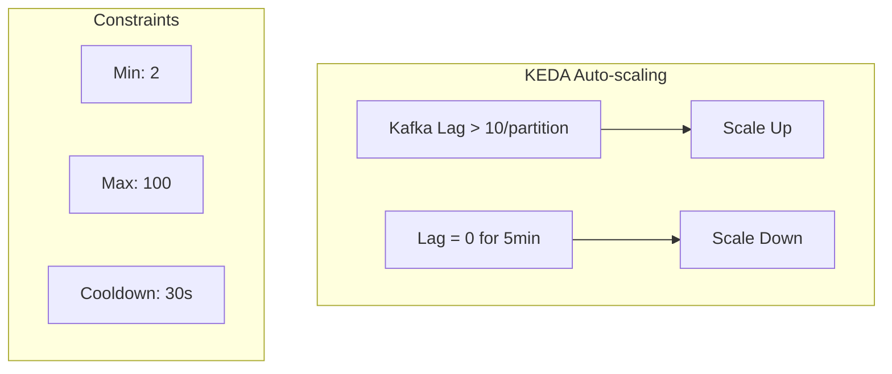

---

## Bottleneck Analysis

### Identified Bottlenecks

#### Bottleneck 1: Database Connections

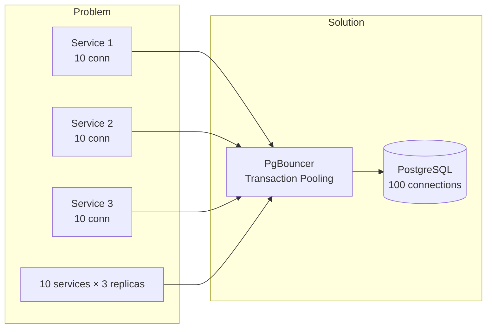

**Problem:** Each service replica needs database connections.  
PostgreSQL default: 100 connections.  
10 services × 3 replicas × 10 connections = 300 connections

**Solution:** PgBouncer transaction pooling
- 100 PgBouncer connections to PostgreSQL
- 1000+ application connections to PgBouncer
- Transaction pooling mode (connection reused after TX)

#### Bottleneck 2: Kafka Partitions

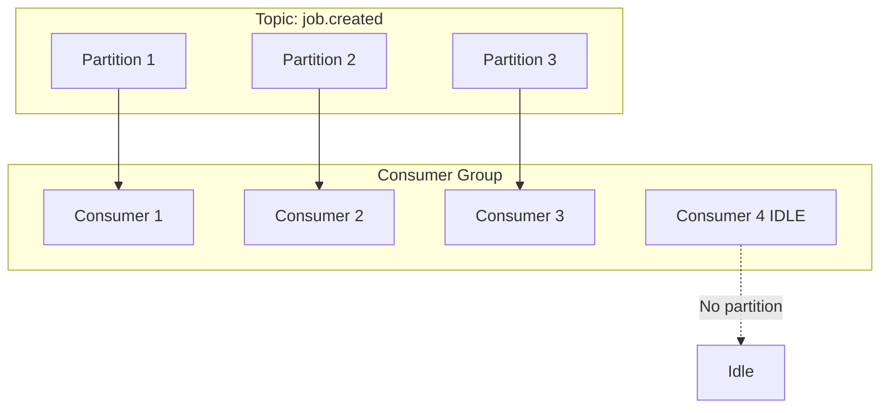

**Problem:** Consumer parallelism limited by partition count.  
More consumers than partitions = idle consumers.

**Solution:** Sufficient partitions upfront
- job.created: 32 partitions
- execution.events: 16 partitions
- Partition key: tenant_id (ensures ordering per tenant)

#### Bottleneck 3: Scheduler Leader

**Problem:** Only one scheduler instance is active (leader election).  
All schedule evaluation happens on one instance.

**Solution:** Efficient evaluation + sharding (future)
- Current: Single leader, evaluates all schedules
- Optimization: Batch schedule evaluation
- Future: Shard schedules by tenant hash

#### Bottleneck 4: Log Ingestion

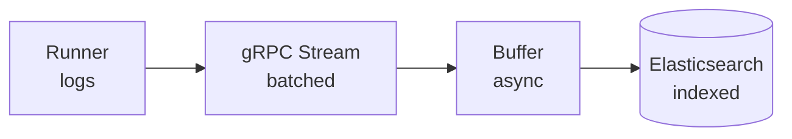

**Problem:** High-volume log streams from runners.  
1000 runners × 100 log lines/second = 100K lines/second

**Solution:** Buffering + async ingestion
- Runner buffers logs, sends in batches
- gRPC streaming with flow control
- Async write to log store (Elasticsearch/Loki)
- Sampling for very verbose jobs (configurable)

### Performance Targets

| Operation | Target Latency | P99 Latency | Throughput |
|-----------|----------------|-------------|------------|
| Create pipeline | < 100ms | < 500ms | 100/sec |
| Trigger execution | < 200ms | < 1s | 500/sec |
| Job assignment | < 1s | < 5s | 1000/sec |
| Log retrieval | < 500ms | < 2s | 100/sec |
| GraphQL query | < 200ms | < 1s | 1000/sec |
| Webhook trigger | < 100ms | < 500ms | 500/sec |

---

## Failure Modes

### Failure Taxonomy

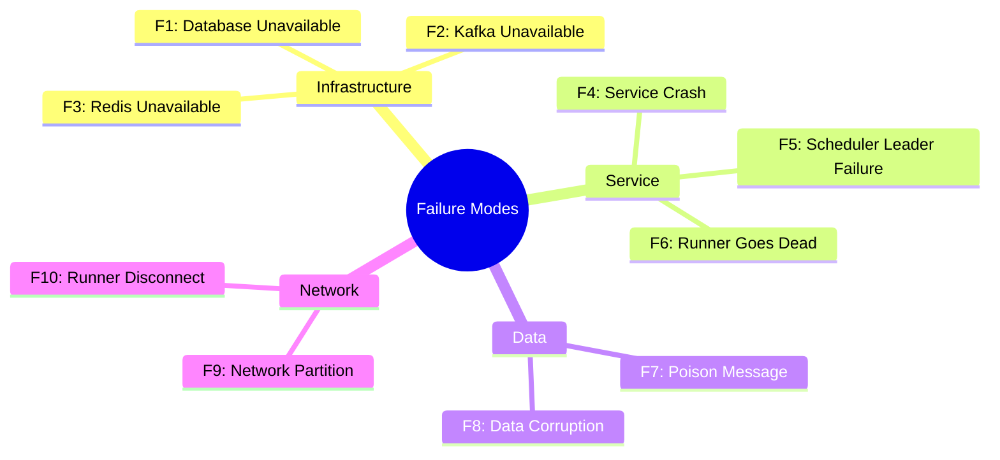

### Infrastructure Failures

#### F1: Database Unavailable

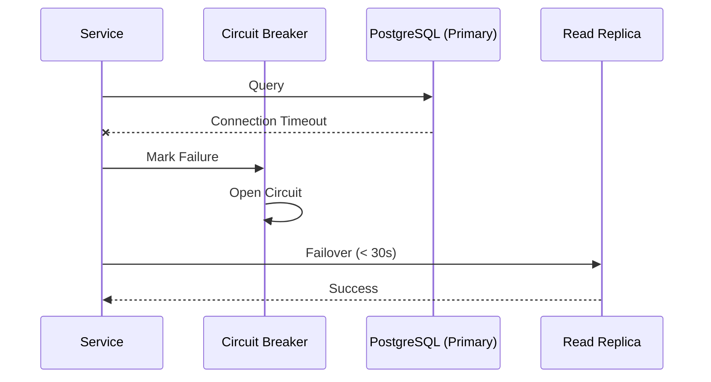

**Impact:** All writes fail, reads from cache may continue  
**Detection:** Connection timeout, health check failure  
**Mitigation:**
- Automatic failover to read replica (< 30s)
- Circuit breaker prevents cascade
- Retry with exponential backoff  
**Recovery:** Automatic (failover) or manual (restore from backup)

#### F2: Kafka Unavailable

**Impact:** Events not published, consumers stall  
**Detection:** Producer timeout, consumer lag spike  
**Mitigation:**
- Outbox pattern: events buffered in database
- Retry publishing when Kafka recovers
- Consumers resume from last committed offset  
**Recovery:** Automatic (Kafka replication) or manual (restore)

#### F3: Redis Unavailable

**Impact:** Cache miss, runner heartbeats not tracked  
**Detection:** Connection timeout  
**Mitigation:**
- Fallback to database for cache
- Runner heartbeats: temporary blind spot (< 60s)
- No job assignments during outage (safe)  
**Recovery:** Automatic (Redis Sentinel failover)

### Service Failures

#### F4: Service Crash

**Impact:** Requests to that replica fail  
**Detection:** Kubernetes liveness probe failure  
**Mitigation:**
- Multiple replicas (N+1 redundancy)
- Load balancer routes to healthy replicas
- Kubernetes restarts failed pod  
**Recovery:** Automatic (< 60s for pod restart)

#### F5: Scheduler Leader Failure

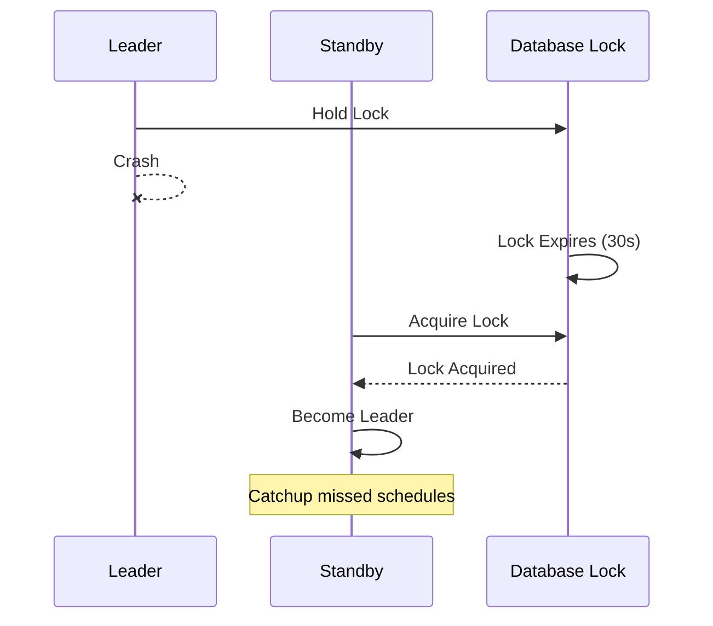

**Impact:** Schedules not evaluated during failover  
**Detection:** Leader lock expires  
**Mitigation:**
- Standby instance acquires leadership
- Catchup policy handles missed schedules  
**Recovery:** Automatic (< 30s for leader election)

#### F6: Runner Goes Dead

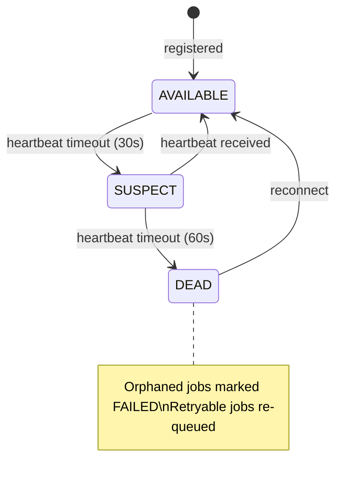

**Impact:** Jobs on that runner are orphaned  
**Detection:** Heartbeat timeout (60s)  
**Mitigation:**
- Runner marked DEAD after 60s silence
- Orphaned jobs marked FAILED
- Retryable jobs re-queued  
**Recovery:** Automatic (jobs reassigned to other runners)

### Data Failures

#### F7: Poison Message in Kafka

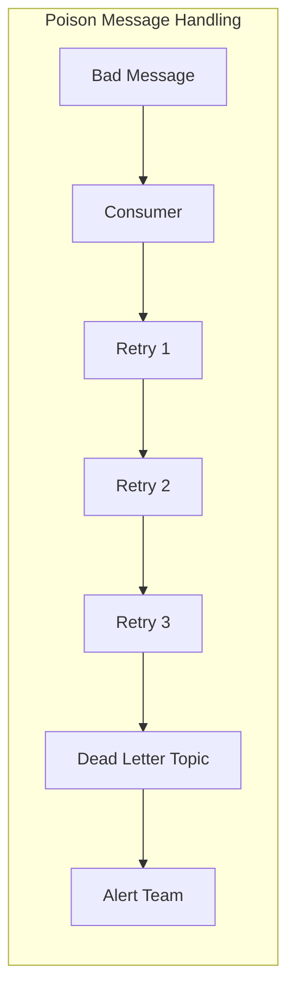

**Impact:** Consumer crashes repeatedly on same message  
**Detection:** Repeated consumer restart, same offset  
**Mitigation:**
- Retry limit (3 attempts)
- Dead Letter Topic (DLT) for failed messages
- Alert on DLT ingestion  
**Recovery:** Manual investigation of DLT messages

#### F8: Data Corruption

**Impact:** Incorrect state, potential cascading errors  
**Detection:** Constraint violations, application errors  
**Mitigation:**
- Database constraints
- Event sourcing enables replay from events
- Point-in-time recovery from backups  
**Recovery:** Restore from backup, replay events

### Network Failures

#### F9: Network Partition

**Impact:** Services can't communicate  
**Detection:** Connection timeouts, health check failures  
**Mitigation:**
- Circuit breaker pattern
- Async communication via Kafka (eventually consistent)
- Local caching for read operations  
**Recovery:** Automatic when network heals

#### F10: Runner Network Disconnect

**Impact:** Runner can't receive jobs or report status  
**Detection:** Heartbeat timeout  
**Mitigation:**
- Runner continues executing current job
- Buffers logs locally
- Reconnects with exponential backoff
- On reconnect: flushes buffered logs, reports status  
**Recovery:** Automatic reconnection

### Failure Response Matrix

| Failure | Detection Time | Auto-Recovery | RTO | RPO |
|---------|----------------|---------------|-----|-----|
| Database down | < 10s | Yes (failover) | < 30s | 0 |
| Kafka down | < 30s | Yes (replication) | < 60s | 0 |
| Service crash | < 15s | Yes (K8s restart) | < 60s | 0 |
| Scheduler leader | < 30s | Yes (election) | < 30s | Catchup |
| Runner dead | 60s | Yes (reassign) | < 120s | Checkpoint |
| Network partition | Variable | Yes | Variable | 0 |
| Data corruption | Manual | No | Hours | Backup age |

---

## Disaster Recovery

### Recovery Objectives

| Tier | RTO | RPO | Scenario |
|------|-----|-----|----------|
| **Tier 1** (Critical) | < 1 hour | < 1 minute | Complete region failure |
| **Tier 2** (Important) | < 4 hours | < 15 minutes | Database corruption |
| **Tier 3** (Standard) | < 24 hours | < 1 hour | Non-critical data loss |

### Backup Strategy

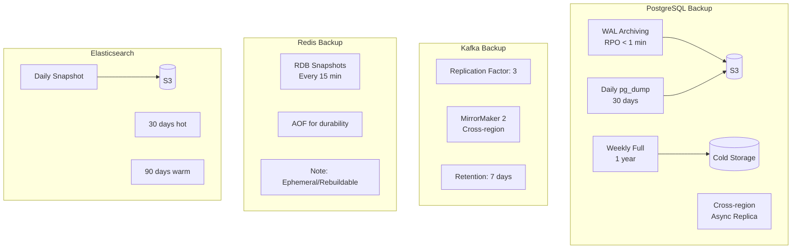

### DR Runbook

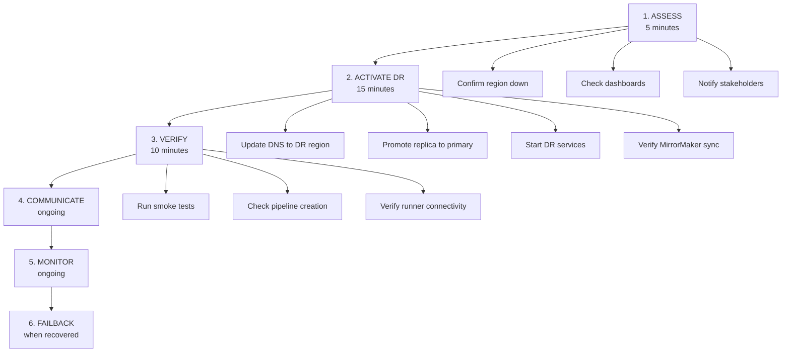

**RTO Target:** 1 hour  
**RPO Target:** 1 minute (WAL archiving)

---

## Capacity Planning

### Resource Sizing Guidelines

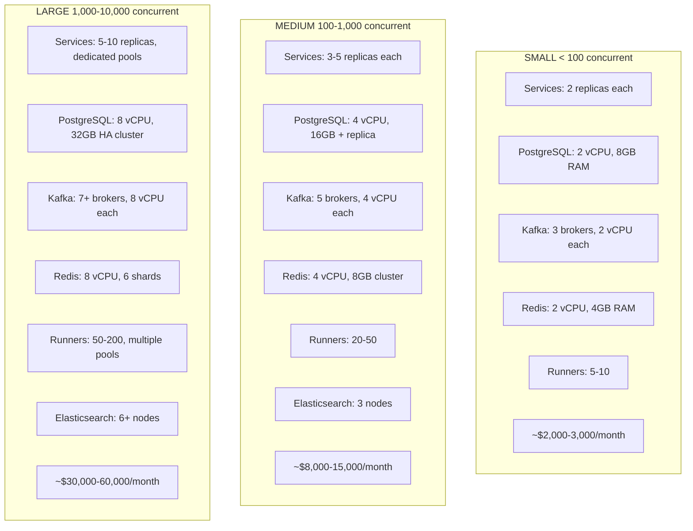

### Scaling Triggers

| Component | Metric | Scale Up | Scale Down |
|-----------|--------|----------|------------|
| Gateway | CPU > 70% | Add replica | CPU < 30% for 10m |
| Services | CPU > 70% | Add replica | CPU < 30% for 10m |
| Runners | Kafka lag > 10 | Add runner | Lag = 0 for 5m |
| PostgreSQL | Connections > 80% | Increase pool | N/A |
| Kafka | Disk > 70% | Add broker | N/A |

---

## Interview Questions

**Q: "How does Pravah scale to handle 10,000 concurrent executions?"**
> Multiple dimensions:
> 1. **Stateless services** scale horizontally (add replicas)
> 2. **Kafka partitions** enable parallel event processing
> 3. **KEDA auto-scales runners** based on queue depth
> 4. **PgBouncer** multiplexes database connections
> 5. **Read replicas** handle read-heavy workloads

**Q: "What happens if the database goes down?"**
> 1. Circuit breaker activates, preventing cascade
> 2. Automatic failover to read replica (< 30s)
> 3. Writes are buffered (outbox survives in replica's WAL)
> 4. Services degrade gracefully (reads from cache)
> 5. After recovery, outbox catches up Kafka

**Q: "How do you handle a runner that crashes mid-job?"**
> 1. Runner heartbeat times out after 60 seconds
> 2. Runner Service marks runner DEAD
> 3. Orphaned jobs are marked FAILED
> 4. Jobs with retries remaining are re-queued
> 5. Checkpoints allow resumption from last successful stage

**Q: "What's your disaster recovery strategy?"**
> 1. **RPO < 1 minute**: WAL archiving to S3
> 2. **RTO < 1 hour**: Warm standby in DR region
> 3. Cross-region PostgreSQL replica (async)
> 4. Kafka MirrorMaker 2 for topic replication
> 5. Documented runbook with regular testing

**Q: "How do you prevent cascading failures?"**
> Multiple layers:
> 1. **Circuit breakers** (Resilience4j) stop calls to failing services
> 2. **Bulkheads** isolate thread pools per downstream
> 3. **Timeouts** on all external calls
> 4. **Async communication** via Kafka (decouples services)
> 5. **Graceful degradation** (serve from cache when DB slow)

**Q: "What are the main bottlenecks and how do you address them?"**
> 1. **Database connections**: PgBouncer transaction pooling
> 2. **Kafka partitions**: Pre-provision sufficient partitions (32+)
> 3. **Scheduler leader**: Efficient batch evaluation, future sharding
> 4. **Log ingestion**: Buffering, batching, sampling for verbose jobs

---

## Document History

| Version | Date | Author | Changes |
|---------|------|--------|---------|
| 1.0 | 2026-05-13 | Engineering | Initial analysis |
| 1.1 | 2026-05-13 | Engineering | Updated to Mermaid diagrams |
