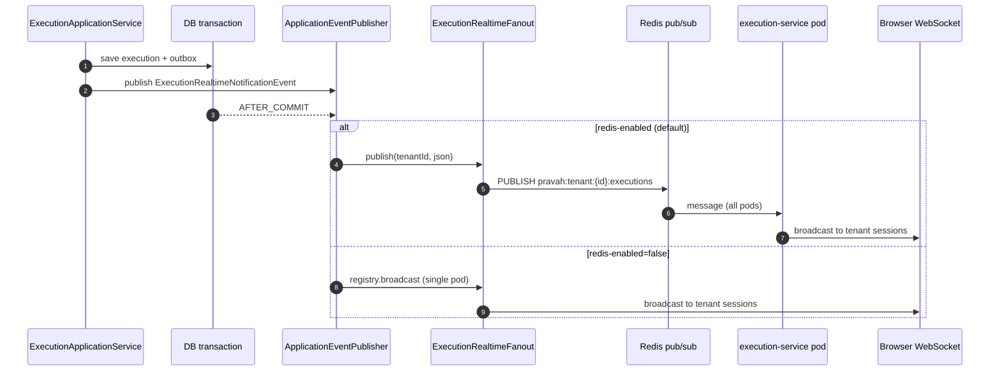

# Execution Real-Time WebSocket (US-12.10)

Ephemeral browser push for execution status changes. **Durable truth** remains Kafka + outbox (`execution.created`, `execution.cancelled`, job events). WebSocket frames are a read-side signal for the SPA only.

---

## Endpoint

| Item | Value |
|------|--------|
| Path | `GET /ws/v1/executions` (HTTP upgrade) |
| Owner | `execution-service` |
| Gateway | `Path=/ws/**` → `lb://execution-service` |
| Auth | JWT at handshake (not Spring Security filter chain on upgrade) |

### Authentication

Browsers cannot set `Authorization` on `WebSocket` reliably. The handshake accepts:

1. Query: `access_token=<JWT>` (SPA default)
2. Header: `Authorization: Bearer <JWT>`

On success, `tenantId` and `userId` are stored in session attributes. On failure, handshake returns **without** upgrading (no JSON error body).

**Operations:** Do not log full request URLs at INFO (query may contain short-lived tokens). Use short-lived access tokens in production.

### CORS

`pravah.realtime.websocket.allowed-origins` / `PRAVAH_WS_ALLOWED_ORIGINS` — comma-separated SPA origins. Missing origin → failed handshake.

---

## Fan-out



| Mode | Property | Use case |
|------|----------|----------|
| Redis pub/sub | `pravah.realtime.redis-enabled=true` (default) | Multi-instance / K8s |
| In-process | `PRAVAH_REALTIME_REDIS_ENABLED=false` | Local single pod, integration tests |

Channel pattern: `pravah:tenant:{tenantId}:executions`

---

## Message schema

JSON text frame (one object per push):

```json
{
  "type": "execution.updated",
  "executionId": "uuid",
  "status": "pending|running|succeeded|failed|cancelled",
  "occurredAt": "2026-05-16T10:00:00.000Z",
  "pipelineId": "uuid"
}
```

Clients filter by `executionId` when viewing a single run; list/dashboard views accept any frame for the tenant.

**Not included in US-12.10:** log streaming, per-job events, server-side execution subscription (tenant-wide broadcast only).

---

## When frames are published

| Trigger | Source |
|---------|--------|
| Manual run created | `ExecutionApplicationService` (after commit) |
| Execution cancelled | `ExecutionApplicationService` |
| Execution status changes (e.g. PENDING→RUNNING) | `ExecutionCreatedProcessingService`, `JobCreatedProcessingService` (`publishExecutionStatusIfChanged`) |

---

## Security

- Sessions registered only after successful JWT validation with valid `tenantId`.
- Broadcast is **tenant-scoped**; cross-tenant delivery must not occur (see `ExecutionWebSocketIT`).
- No execution-level ACL on the socket: any authenticated user in the tenant receives all execution updates for that tenant (alpha). Fine-grained subscription is a future optimization.

---

## Related

- [Sequence diagrams — Trigger Execution](04-sequence-diagrams.md#2-trigger-execution) (durable path)
- [Theory — Redis pub/sub for WebSocket scaling](../theory/phase-3-database-design/3.8-redis-caching-locking-pubsub.md)
- EPIC-12 US-12.10 (product); US-12.09 (future log streaming)
